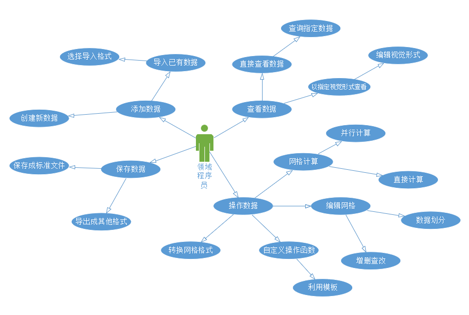

# Use-Case Model 用例模型

### Use case diagrams 用例图

#### 修订历史

|版本|日期|说明|作者|
|---|-----|---|----|
|启动阶段1.07|2021年3月27日|创建用例图|陈家龙|

### Use cases 用例

#### 修订历史

|版本|日期|说明|作者|
|---|-----|---|----|
|启动阶段1.00|2021年3月27日|创建用例4、5、6、14、24|杨宗恺|
|启动阶段1.01|2021年3月27日|创建详细用例1、2、3|胡若晴|
|启动阶段1.02|2021年3月27日|创建用例7、8、9|李浩天|
|启动阶段1.03|2021年3月27日|创建用例10、11、12、13|莫振威|
|启动阶段1.04|2021年3月27日|创建用例15、16、17|胡洁珏|
|启动阶段1.05|2021年3月27日|创建用例18、19、20|崔子潇|
|启动阶段1.06|2021年3月27日|创建用例21、22、23|丁维力|
|细化阶段-迭代1|2021年5月22日|创建详细用例25、26、27|杨宗恺|

#### UC1：读取数据文件到还未有文件打开软件中

1. **范围：** 整个系统
2. **级别：** 用户目标级
3. **参与者：** 领域用户、类库
4. **主要成功场景：**
   * 领域用户在软件的工具栏点击“打开文件”，选择要打开的文件后，点击“打开”
   * 类库调用函数，查询判断文件格式是否正确，是否可读，成功则将文件导入软件
   * 类库调用函数，将导入的文件以图表或图形的形式显示
   *  领域用户可以在视图区域看到导入的文件以图表或图形的形式显示

5. **备选场景：** 文件打开失败

   *  在第2步，类库调用函数发现文件格式错误，弹出提示打开文件格式错误，并允许领域用户重新选择格式正确的网格数据文件。

   * 类库调用函数发现文件不可读，弹出提示打开文件不可读，并允许领域用户重新选择可读的网格数据文件。

#### UC2：保存文件

1. **范围：** 整个系统
2. **级别：** 用户目标级
3. **参与者：** 领域用户、类库
4. **主要成功场景：**
   *  领域用户在软件的工具栏点击“保存文件”
   *  领域用户选择要保存的文件路径后，选择“保存格式”
   *  领域用户点击“保存”
   * 类库调用函数，将文件以选择的格式保存在指定的文件路径中

5. **备选场景**：文件保存失败

   在第4步，若保存的文件路径容量不够，弹出提示存储容量已满，并允许领域用户选择新的存储路径

#### UC3：导入数据文件到已经有文件打开软件中

1. **范围：** 整个系统
2. **级别：** 用户目标级
3. **参与者：** 领域用户、类库
4. **主要成功场景：**
   * 领域用户在软件的工具栏点击“打开文件”，选择要打开的文件后，点击“打开”
   * 类库调用函数，查询判断文件格式是否正确，是否可读，成功则将文件导入软件
   *  类库调用函数，弹出提示，让用户选择是覆盖当前文件的视图窗口还是创建一个新的视图窗口显示
   * 领域用户若选择覆盖，则在原来的视图窗口进行操作，选择创建一个新的视图窗口，那么就在新的视图窗口进行操作
   * 将导入的文件在选择的视图窗口以图表或图形的形式显示
   * 领域用户可在选择出的视图区域看到导入的文件以图表或图形的形式显示

5. **备选场景：** 文件打开失败

   * 在第2步，类库调用函数发现文件格式错误，弹出提示打开文件格式错误，并允许领域用户重新选择格式正确的网格数据文件。

   * 类库调用函数发现文件不可读，弹出提示打开文件不可读，并允许领域用户重新选择可读的网格数据文件。

#### UC4：创建新的结点

1. **主要成功场景：**

   领域用户在软件的工具栏点击“创建新的结点”，类库调用函数将鼠标光标呈现为指示链接的指针，领域用户移动光标在一个位置点击鼠标，这个位置上就会出现一个新的结点。

2. **备选场景：**

    用户可以在坐标区域输入想要创建的结点的坐标，然后点击“创建结点”，就可以在指定的位置创建一个新的结点

#### UC5：创建新的线段

1. **主要成功场景：**

   领域用户在软件的工具栏点击“创建新的线段”，类库调用函数将鼠标光标呈现为指示链接的指针，领域用户移动光标在一个位置点击鼠标，然后拖动光标到另一位置直到放开鼠标，这两个位置之间就会出现一个新的线段。

2. **备选场景：**

   用户可以在坐标区域输入想要创建的线段的两个端点的坐标，然后点击“创建线段”，就可以在指定的位置创建一个新的线段

#### UC6：创建新的矩形

1. **主要成功场景：**

   领域用户在软件的工具栏点击“创建新的矩形”，类库调用函数将鼠标光标呈现为指示链接的指针，领域用户移动光标在一个位置点击鼠标，然后拖动光标到另一位置直到放开鼠标，类库会自动根据这两个位置之间的水平距离和垂直距离创建一个新的矩形。

2. **备选场景：**

   用户可以在坐标区域输入想要创建的矩形的左上角端点和右下角端点的坐标，然后点击“创建矩形”，就可以在指定的位置创建一个新的矩形

#### UC7：创建新的圆形

1. **主要成功场景:**

   领域用户在软件的工具栏点击"创建新的圆形",类库调用函数将鼠标光标呈现为指示链接的指针,领域用户在一个位置点击鼠标,将圆心确定于此位置,然后拖动鼠标,将出现一个以圆心到鼠标的距离为半径的新的圆形。

2. **备选场景:**

   用户可以在坐标区域输入想要创建的圆的圆心和半径,然后点击"创建圆形",就可以在指定位置创建一个圆形。

#### UC8：创建新的三维立体矩形

1. **主要成功场景:**

   领域用户在软件的工具栏点击"创建新的三维立体矩形",类库调用函数将鼠标光标呈现为指示链接的指针,领域用户在一个位置点击鼠标,然后拖动光标到另一位置直到放开鼠标,类库会自动根据这两个位置之间的水平距离和垂直距离创建出一个立方体底面,然后用户向上或者向下拖动鼠标可以确定出这个立方体的高度并创建图形。

2. **备选场景:**

   用户可以在坐标区域输入一个基点的坐标,并输入立方体的长宽高即可在指定位置创建一个矩形。 

#### UC9：创建新的球

1. **主要成功场景:**

   领域用户在软件的工具栏点击"创建新的球",类库调用函数将鼠标光标呈现为指示链接的指针,领域用户在一个位置点击鼠标,将球心确定于此位置,然后拖动鼠标,将出现一个以球心到鼠标的距离为半径的新的球体。

2. **备选场景:**

​    用户可以在坐标区域输入想要创建的球的球心和半径,然后点击"创建球",就可以在指定位置创建一个球体。

#### UC10：拉伸二维图形的点

1. **主要成功场景：**

   领域用户在软件的工具点击“拉伸点”，类库调用函数将鼠标光标呈现为指示链接的指针，领域用户在二维图形位置点击鼠标，此时二维图形进入可修改模式，并显示所有的坐标点。领域用户用鼠标选择任意坐标点后，进行拖动操作，即可对该点进行拉伸，拉伸效果为与该点相连的线段都会随着坐标点的移动而变化

2. **备选场景：**

   在创建二维图形时，二维图形将处于可修改模式，用户此时可以对二维图形的任意坐标点进行拉伸操作

   用户可以在坐标区域输入二维图形的坐标点，然后点击“拉伸”，就可以对该坐标点进行拉伸

#### UC11：拉伸二维图形的线段

1. **主要成功场景：**

   领域用户在软件的工具点击“拉伸点”，类库调用函数将鼠标光标呈现为指示链接的指针，领域用户在二维图形位置点击鼠标，此时二维图形进入可修改模式。领域用户用鼠标选择任意二维图形的任意线段后，进行拖动操作，即可对该线段进行拉伸

2. **备选场景：**

    在创建二维图形时，二维图形将处于可修改模式，用户此时可以对二维图形的任意线段进行拉伸操作

    用户可以在坐标区域输入二维图形任意线段端点的坐标点，然后点击“拉伸”，就可以对选定线段进行拉伸

#### UC12：拉伸三维图形的点

1. **主要成功场景：**

   领域用户在软件的工具点击“拉伸点”，类库调用函数将鼠标光标呈现为指示链接的指针，领域用户在三维图形位置点击鼠标，此时三维图形进入可修改模式，并显示所有的坐标点。领域用户用鼠标选择任意坐标点后，进行拖动操作，即可对该点进行拉伸，拉伸效果为与该点相连的线段都会随着坐标点的移动而变化

2. **备选场景：**

    在创建三维图形时，二维图形将处于可修改模式，用户此时可以对三维图形的任意坐标点进行拉伸操作

    用户可以在坐标区域输入三维图形的坐标点，然后点击“拉伸”，就可以对该坐标点进行拉伸

#### UC13：拉伸三维图形的线段

1. **主要成功场景**：

   领域用户在软件的工具点击“拉伸点”，类库调用函数将鼠标光标呈现为指示链接的指针，领域用户在三维图形位置点击鼠标，此时二维图形进入可修改模式。领域用户用鼠标选择任意三维图形的任意线段后，进行拖动操作，即可对该线段进行拉伸

2. **备选场景：**

    在创建三维图形时，二维图形将处于可修改模式，用户此时可以对三维图形的任意线段进行拉伸操作

    用户可以在坐标区域输入三维图形任意线段端点的坐标点，然后点击“拉伸”，就可以对选定线段进行拉伸

#### UC14：点击两个点在之间创建线段

1. **主要成功场景**：

   领域用户在软件的工具栏点击“创建新的线段”，库类调用函数将鼠标光标呈现为指示连接的指针，领域用户移动光标在一个点处点击鼠标，然后拖动光标到另一个点后放开鼠标，便可以在这两个点之间生成线段.

2. **备选场景：**

    领域用户在软件的工具栏点击“创建新的线段”，库类调用函数将鼠标光标呈现为指示连接的指针，领域用户移动光标在一个点出点处鼠标，然后在另一个点处点击鼠标，便可以在这两个点之间生成线段。

#### UC15：放大视图

1. **主要成功场景：**

   领域用户在软件的工具栏点击“调整视图”，库类调用函数将鼠标光标呈现为指示连接的指针，领域用户移动光标在一个位置点击鼠标，然后拖动光标使生成的虚线框包含图形后放开鼠标，点击”调整视图“栏的加号（放大）图标将虚线框出的视图放大到需要大小停止点击即可。

2. **备选场景：**

    在绘图界面持续按住鼠标左键，向上滑动鼠标中键直至视图放大到需要大小即可。

    用户可以在坐标区域输入想要放大的视图矩形范围的左上角端点和右下角端点的坐标，然后点击”调整视图“中的加号（放大）图标将选择范围的视图放大到需要大小停止点击即可。

#### UC16：缩小视图

1. **主要成功场景：**

   领域用户在软件的工具栏点击“调整视图”，库类调用函数将鼠标光标呈现为指示连接的指针，领域用户移动光标在一个位置点击鼠标，然后拖动光标使生成的虚线框包含图形后放开鼠标，点击”调整视图“栏的减号（缩小）图标将虚线框出的视图缩小到需要的大小停止点击即可。

2. **备选场景：**

    在绘图界面持续按住鼠标左键，向下滑动鼠标中键直至视图缩小到需要大小即可。

    用户可以在坐标区域输入想要缩小的视图矩形范围的左上角端点和右下角端点的坐标，然后点击”调整视图“中的减号（缩小）图标将选择范围的视图缩小到需要大小停止点击即可。

#### UC17：删除点

1. **主要成功场景：**

   领域用户在软件的工具栏点击“删除点”，库类调用函数将鼠标光标呈现为指示连接的指针，领域用户移动光标在图像一个点处点击鼠标，这个位置的点会被删除，呈现空白。

2. **备选场景：**

   用户可以在坐标区域输入想要删除的点的坐标，然后点击“删除点”，就可以将指定位置的点删除

#### UC18：删除线段

1. **主要成功场景：**

   领域用户选择一条线段，这条线段会高亮显示。按下delete键删除或右键（再选择删除），这条线段就会被删掉。

2. **备选场景：**

    用户可以点击菜单栏下的删除，再点击删除下的删除线段，进入删除线段模式，这个阶段不会选择其他的图形。之后Ctrl-A来选择所有的线段（不进入删除模式的话Ctrl-A会选择界面上的所有的图形），这些线段高亮显示，再进行如上的删除操作。

    同理，在进入删除线段模式后，用户用户可以拖动鼠标选择一部分线段，这些线段高亮显示，再进行如上的删除操作。

#### UC19：删除二维图形

1. **主要成功场景：**

   领域用户选择一个二维图形，这个二维图形会高亮显示。按下delete键删除或右键（再选择删除），这个二维图形就会被删掉。

2. **备选场景：**

    用户可以点击菜单栏下的删除，再点击删除下的删除二维图形，进入删除二维图形模式，这个阶段不会选择其他的图形。用户可以Ctrl-A来选择所有的二维图形，这些二维图形高亮显示，再进行如上的删除操作。

    同理，在进入删除二维图形模式后，用户可以拖动鼠标选择一部分二维图形，这些二维图形高亮显示，再进行如上的删除操作。

#### UC20：删除三维图形

1. **主要成功场景：** 领域用户选择一个三维图形，这个三维图形会高亮显示。按下delete键删除或右键（再选择删除），这个三维图形就会被删掉。

2. **备选场景：**

    用户可以点击菜单栏下的删除，再点击删除下的删除三维图形，进入删除三维图形模式，这个阶段不会选择其他的图形。用户可以Ctrl-A来选择所有的三维图形，这些三维图形高亮显示，再进行如上的删除操作。

    同理，在进入删除三维图形模式后，用户可以拖动鼠标选择一部分三维图形，这些三维图形高亮显示，再进行如上的删除操作。

#### UC21：计算选定直线的长度

1. **主要成功场景：**

   领域用户在软件的功能栏点击“计算”，选定计算“计算选定直线的长度”，类库调用函数将鼠标光标呈现为指示链接的指针，领域用户移动光标点击一条直线，就会在结果区域输出选定直线的长度。

2. **备选场景：**

     用户可以直接在元素选择区的元素1输入框输入想要计算的直线的标号，然后点击“计算长度”，就会在结果区域输出选定直线的长度。

#### UC22：计算选定两条直线之间的角度

1. **主要成功场景：**

   领域用户在软件的功能栏点击“计算”，选定计算“计算选定两条直线之间的角度”，类库调用函数将鼠标光标呈现为指示链接的指针，领域用户移动光标依次点击两条直线，就会在结果区域输出选定两条直线之间的角度。

2. **备选场景：**

     用户可以直接在元素选择区的元素1输入框输入想要计算角度的第一条直线的标号，然后点击“创建元素”，在元素2输入框输入想要计算角度的第二条直线的标号，点击“计算角度”，就会在结果区域输出选定两条直线之间的角度

#### UC23：计算选定平面的面积

1. **主要成功场景：**

   领域用户在软件的功能栏点击“计算”，选定计算“计算选定平面的面积”，类库调用函数将鼠标光标呈现为指示链接的指针，领域用户移动光标点击一个平面，就会在结果区域输出选定平面的面积。

2. **备选场景：**

     用户可以直接在元素选择区的元素1输入框输入想要计算的平面的标号，然后点击“计算面积”，就会在结果区域输出选定平面的面积。

#### UC24：计算选定立体的体积

1. **主要成功场景：** 领域用户选择一个立体图形，这个立体图形会高亮显示。按下右键选择“计算体积”，这个立体的体积就会经过计算显示出来。

2. **备选场景：**

    用户可以先点击菜单栏下的“计算体积”，再点击需要计算的立体图形，这个立体图形的体积也会被显示出来。

#### UC25：以有效的数据结构在内存中存储网格结构

1. **范围：** 整个系统
2. **级别：** 用户目标级
3. **参与者：** 领域用户、类库
4. **主要成功场景：**
   * 领域用户在软件目录放好存储有网格数据的dat文件
   * 领域用户选择好要载入的数据文件，将文件名放在程序中 
   * 类库调用函数，将dat文件中的数据存储在程序的网格结构中

5. **备选场景：** 文件不存在

   *  在第3步，类库调用函数发现文件不存在，打印错误信息，直接退出程序，令用户选择好数据文件再进行。

#### UC26：将网格从内存中以ASCII形式保存到文本文件中

1. **范围：** 整个系统
2. **级别：** 用户目标级
3. **参与者：** 领域用户、类库
4. **主要成功场景：**
   * 领域用户选择好要保存到文本文件中的形式为ASCII
   * 类库调用函数，将载入的网格数据以ASCII的形式写入到目录下的VTK文件里

5. **备选场景：** 文件写入失败

   * 在第2步，类库调用函数但写入失败，直接打印错误信息，退出程序。

#### UC27：将网格从内存中以二进制形式保存到文本文件中

1. **范围：** 整个系统
2. **级别：** 用户目标级
3. **参与者：** 领域用户、类库
4. **主要成功场景：**
   * 领域用户选择好要保存到文本文件中的形式为二进制
   * 类库调用函数，将载入的网格数据以二进制的形式写入到目录下的VTK文件里

5. **备选场景：** 文件写入失败

   * 在第2步，类库调用函数但写入失败，直接打印错误信息，退出程序。

### SSDs 系统顺序图

#### 修订历史

| **版本**      | **日期**      | **说明**       | **作者** |
| ------------- | ------------- | -------------- | -------- |
| 系统顺序图1.0 | 2021年6月13日 | 创建系统顺序图 | 胡洁珏   |

#### **图示：**

