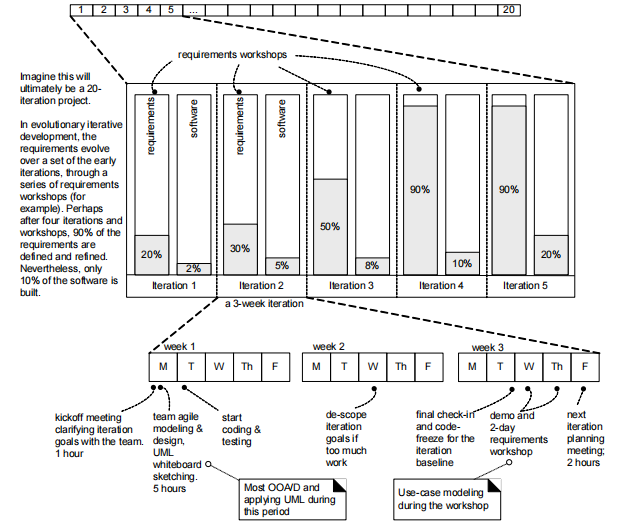
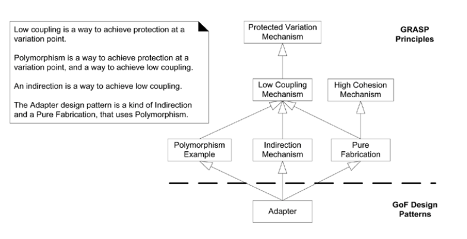

## 系统分析设计

### 1 介绍

#### 1.1 什么是系统分析与设计？

##### 1.1.1 系统（课程名称中第一个关键字）

- 系统是一个非常笼统的术语
    - 可以是电气的、机械的…… 。
- 计算系统是特定类型的系统。（我们关心）
    - 计算机系统被认为是在硬件和软件上进行计算。
- 软件系统（课程涉及）
    - 是运行在通用计算系统上的软件组件的集合。
- 软件系统可以被视为一个通用系统，因为软件系统可以为任何应用领域实现。所以我们在课堂上谈论**软件系统**。

##### 1.1.2 系统分析和设计（课程名称中另外两个关键字）

- **系统分析**强调对系统领域中的**问题和需求**的调查研究，而不是问题的解决方案。
    - “分析”是一个广义的术语，最合适的解释，如
    - 需求分析（对需求的调查）或
    - 面向对象分析（对领域对象的调查）。
- **系统设计**强调满足系统要求的**概念解决方案**（在软件和硬件中），而不是其**实现**。

##### 1.1.3 系统分析和设计方法

- 结构化（功能）方法是一种传统方法，其中系统被视为系统功能的集合。
- 面向对象方法将系统描述为一组协作的对象。
- 我们将在课堂上讨论面向对象的方法。

#### 1.2 什么是面向对象分析与设计？

- 在**面向对象分析**中，重点是发现和描述问题域中的对象或概念。
- 在**面向对象设计**（或简称为对象设计）期间，重点是定义软件对象以及它们如何协作以满足系统要求。
- 在**实现或面向对象编程**中，设计对象是用某种编程语言实现的。

##### 1.2.1 OOAD：原则和模式（课程的一个主要内容）

- OOAD 过程中有许多可能的活动和工件，所以我们为进行 OOAD 提供了丰富的原则和指南。指导方针的一个例子是“**巧妙地为软件对象分配职责**” 。
    - 本课程强调的“最重要的学习目标” 。
    - 这一点会影响软件组件的健壮性、可维护性和可重用性。
- 设计问题的某些久经考验的解决方案可以（并且已经）被视为<u>最佳实践原则、启发式方法或称为问题解决方案公式的**模式**</u>，这些公式编纂了典型的设计原则。
- 本课程通过教授如何应用模式或原则，支持更快地学习和熟练使用这些<u>基本的对象设计风格</u>。

#### 1.3 系统开发过程（课程的另一个关键概念）

##### 1.3.1 软件开发过程

- 考虑到从需求到实现的许多可能的活动，开发人员或团队应该如何进行？
- 需求分析和 OOAD 需要在<u>某些开发过程的背景下</u>呈现和实践。
- **软件开发过程**描述了一种<u>构建、部署和可能维护软件的方法</u>。

##### 1.3.2 系统开发生命周期（相同的另一个概念）

- 系统开发生命周期 (SDLC) 
    - SDLC 是软件开发过程的一部分。 
    - SDLC 有一些基本阶段，例如规划、分析、设计和实施。
    - 每个阶段本身由一系列步骤组成，这些步骤依赖于产生可交付成果的技术。
- 大多数时候，我们在课堂上混合使用软件过程和 SDLC。

##### 1.3.3 系统开发方法（与过程对应的一个概念）

- 系统开发方法
    - 是实施 SDLC 的正式方法，即，它是步骤和可交付成果的列表。
    - 我们从哪里开始？ --> 可行性研究（或早期需求分析）
    - 定义问题 --> 需求分析
    - 设计解决方案 --> 设计
- 本课程是关于开发（软件）系统的方法论！

##### 1.3.4 瀑布式的开发过程（一个基本的软件过程）

- 在瀑布式（或顺序式）系统开发生命周期过程中，会有不真实的期望。
    - 试图在编程前（详细地）定义全部或大部分需求。
    - 通常，在编程之前创建出完整的设计（或模型集）。
    - 同样，试图在开始前就确定一个“可靠的”计划或时间表，但常常事与愿违。

##### 1.3.5 瀑布式开发过程中的顺序过程阶段（理想化的顺序性的独立的阶段）

- 交流
    - 项目启动
    - 需求收集
- 规划
    - 估算
    - 进度安排
    - 跟踪
- 建模
    - 分析
    - 设计
- 构造
    - 代码、测试
- 部署
    - 交付
    - 支持
    - 反馈

##### 1.3.6 迭代和进化开发（课程的另一个重要概念）

- 开发处于短周期或迭代中。
- 每次迭代都经过测试和集成。
- 每次迭代都会给出一个可执行的部分系统。
- 每次迭代的反馈都会导致下一次迭代上的精化和修改。
- 这种过程的一个例子是统一过程(UP)。（课程主要讨论这种方法）

#### 1.4 UML 统一建模语言

- 统一建模语言是一种可视化语言，用于在系统开发阶段指定、构建和记录系统工件。
- 符号（UML）是一个简单的、相对不重要的东西。
- 更重要的是设计对象的技巧。
    - 仅仅学习UML符号对我们进行分析和设计没有帮助。
- UML不是
    - 过程或方法论
    - 面向对象的分析和设计
    - 设计指南。（我们课程将使用UML进行建模）
    
##### 1.4.1 三种应用 UML 的方法

- 首先，UML作为一个非正式的和不完整的草图，用来探索问题或解决方案空间的困难部分。
- 其次，它可以用作蓝图，相对详细的设计图用于
    - 1) 逆向工程，或
    - 2) 代码生成（正向工程）。
- 第三，使用UML作为编程语言，用UML编写软件系统的完整可执行规范。
- 敏捷建模强调 UML 作为草图；这是应用 UML的常用方法，通常具有很高的时间投资回报（通常很短）。
- 我们将在课程中讨论敏捷建模。

##### 1.4.2 使用 UML 进行 OO Modeling

- 需求和分析
    - 用例图
    - 接口模型
    - 业务/领域对象模型
    - 应用程序对象模型
    - 对象交互模型
    - 动态模型
- 设计
    - 设计对象模型
    - 设计对象交互模型
    - 设计动态模型
- 实现：源代码
- 测试：测试用例

##### 1.4.3 应用 UML 的三种透视图（三个层面）

1. 概念透视图：用图来描述现实世界或关注领域的情况。（概念层）
2. 规范说明（软件）透视图：用图来描述软件的抽象物或具有规格说明和接口的构件，但并不约定特定实现。（规范描述层）
3. 实现（软件）层：用图来描述了特定技术（例如，Java）中的软件实现。（实现层）

##### 1.4.4 不同透视图中“类”的含义（与UML和UP一致的类相关术语）

- 概念类（概念层）- 现实世界的概念或事物。在概念或本质透视图中使用。UP领域域模型包含概念类。
- 软件类（软件层）- 表示软件构件在规范说明或实现透视图中的类，与过程或方法无关。
- 实现类（实现层）- 特定 OO 语言（如Java）中的类。

#### 1.5 课程主题（开发方法）

- 课程主题是关于迭代和进化开发方法的，包括：OOAD + 迭代和进化系统开发过程 + 敏捷方法在课程中，对著名的统一过程的敏捷（轻量、灵活）方法(UP) 用作介绍课程主题的示例迭代开发过程。
- 然而，我们在本课程中讨论的主题独立于任何特定的过程，并且适用于许多现代迭代、进化和敏捷方法。

##### 1.5.1 我们将在课程中涵盖的内容包括

- 用对象进行思考和设计
- OOD原则和设计模式
- 敏捷方法论
- 应用UML（可视化建模
- 分析：需求调查和问题领域对象
    - 如演化需求分析
    - 编写用例
- 设计：满足需求的概念解决方案

##### 1.5.2 本课程帮助学生

- 应用原理和模式来创建更好的对象设计。
- 以敏捷方法为例，帮助学生在分析和设计中迭代地遵循一组常见的活动。
- 帮助学生用UML符号创建常用的模型图。

##### 1.5.3 学生在这门课上会做什么？

- 学生将进行分析和设计
    - 编写用例
    - 创建领域模型
    - 创建类图
    - 编写程序。

##### 1.6 摘要

- 系统
- 系统分析与设计
- 面向对象分析与设计
- 系统开发生命周期（软件过程）
- 系统开发方法
- 迭代和进化式开发
- 在系统开发中建模

### 2 Iterative and Evolutionary Development 迭代和进化式开发

- 主题
    - 迭代和进化式开发
    - 统一过程

#### 2.1 瀑布（Waterfall）模型的缺点

##### 2.1.1 瀑布模型：

- 在**瀑布式**（或顺序式）生命周期过程中，
    - 试图在编程前（详细地）定义全部或大部分需求。
    - 通常，在编程之前创建出完整的设计（或模型集）。
    - 同样，试图在开始前就确定一个“可靠的”计划或时间表，但常常事与愿违。

##### 2.1.2 瀑布模型的缺点

- 实际情况是，不仅软件发生了变化，而且在过程中也发生了变化
    - 现实模型不是严格的线性模型，而允许周期性
    - 但是，请记住，周期越多，成本就越高
- 没有考虑文档的转换，无法深入了解每个活动如何将一个阶段的一个工件（文档）转换为另一个阶段
    - 例如，需求规范->设计文档？
- 未能将软件开发视为解决问题的过程
    - 软件开发不是一个制造过程，而是一个创造性的过程
    - 制造过程确实可以是线性过程，但具有创造性的过程通常涉及反复的活动，如修改
    - 软件开发涉及各种利益相关者之间的大量交流
- 然而，更复杂的模型往往会修饰瀑布
    - 整合反馈循环和其他活动

#### 2.2 Iterative and evolutionary development Process 迭代和进化式开发过程

##### 2.2.1 Phased development 分阶段开发

- 分阶段开发减少**周期时间**
    - 让用户在开发其他功能的同时拥有一些功能
- 所以通常有两个或两个以上并行系统：
    - 客户使用的**操作**或**生产**系统
    - 取代当前版本的**开发**系统
    - 用户使用版本n时，开发人员正在构建n+1版本

##### 2.2.2 Iterative and incremental process 迭代和增量过程

- **增量开发**按功能划分系统
    - 早期版本从小型的、功能性的子系统开始，后期版本添加功能，直至完整的功能（功能递增）
- **迭代开发**在每个版本中改进了整个系统
    - 在第一个版本中提供完整的系统，然后在每个新版本中更改每个子系统的功能（性能递增）
- 假设一个客户想要开发一个字处理包
    - **增量方法：** 在版本1中只提供创建函数，然后在版本2中提供创建和组织，最后在版本3中添加格式…
    - **迭代方法：** 在版本1中提供所有三个函数的原始形式，然后在后续版本中增强（使它们更快，改进接口等）
    - 这两种方法的利弊？
- 许多组织将迭代和增量方法结合起来

##### 2.2.3 Iterative and Evolutionary Development 迭代和进化式开发

- 它是一个迭代和增量开发
- 生命周期包括在重复周期中对部分系统进行早期编程和测试。
    - **开发周期很短**，或者说是**迭代**
    - 每次迭代都经过**测试和集成**
    - 每次迭代都给出了一个**可执行的局部系统**
- 每次迭代的反馈会导致下一次迭代的**精化和修正**。
- 通常假设在详细定义所有需求之前开始开发
- 这种过程的一个例子是**统一过程**（UP）。

#### 2.3 处理迭代和进化式开发中的变化

- 每次迭代都涉及到选择需求的**一小部分**，并**快速**设计、实现和测试。
- 在早期迭代中，需求和设计的选择可能并不完全是最终所期望的。
- 但是在所有需求最终确定之前，或者在整个设计被推测性地定义之前，迅速采取一小步的行为，会导致来自用户、开发人员和测试（比如负载和可用性测试）的**快速反馈**。
- 除了明确需求，负载测试等活动也将证明
    - 如果部分设计和实现走上了正确的道路，或者
    - 如果在下一次迭代中，需要更改核心架构。
- 最好**尽早**解决和证明风险和关键的设计决策，而不是之后
- 迭代开发提供了这种机制。
- 迭代反馈和进化早期迭代离系统的“真实路径”更远。通过反馈和调整，系统会朝着最合适的要求和设计收敛。
- 在后期迭代中，需求的重大变化很少见，但可能会发生。这种较晚的更改可能会给组织带来竞争性业务优势。

#### 2.4 迭代和进化开发的好处

- 更少的故障，更低的缺陷率，瀑布开发导致80%以上失效
- 早期缓解高风险
- 早期可见的进展
- 早期反馈、用户参与和调整
- 可控的复杂度：团队一次只看到一小部分
- 在迭代中使用学习来改进开发过程本身

#### 2.5 摘要

- 为什么要迭代和增量开发？
- 迭代和进化开发过程
- 在迭代和进化开发中处理变化
- 迭代开发的好处

### 3 统一和敏捷方法

#### 3.1 Unified Process 统一过程

- 统一过程是一种流行的用于构建面向对象系统的迭代和增量软件开发过程。
- 过程是可伸缩的：您不需要为每个项目使用整个过程框架，只需要那些有效的。
- 该过程是有效的：它已成功地应用于大量项目。
- 通过使用您可能已经使用过（但不知道）的实用方法提高生产率。
- 迭代和增量方法**允许在知识不完整、不完善的情况下开始工作。**
- UP是**用例驱动的**
- UP**以体系结构为中心**
- UP**以风险为中心**

##### 3.1.1 Use Case Driven 用例驱动

- 用例
    - 一系列动作的散文式表达 **（段落描述）**
    - 动作由一个或多个参与者 **（人类或非人类）和系统**本身执行
    - 这些行动为一个或多个行为者带来有价值的结果，帮助行为者实现其目标
- 用例是从**用户的角度**用自然语言表达的，所有利益相关者都应该理解
- **用例驱动**意味着开发团队使用从需求收集到代码和测试的用例

##### 3.1.2 Architecture Centric 以系统结构为中心

- 软件体系结构捕获有关以下方面的决策：
    - 软件系统的**总体结构**
    - 系统的**结构元素**及其**接口**
    - 这些结构元素之间的**协作**及其预期行为
- 以体系结构为中心：软件体系结构提供了所有其他开发围绕的中心点
    - 提供系统的 **“大图”**
    - 提供开发的**组织框架**，通过关注系统的**可修改**性来改进系统
    - 便于**重用**

##### 3.1.3 Risk-Driven and Client-Driven Planning 风险驱动和客户驱动的计划

- UP鼓励结合**风险驱动**和**客户驱动**的迭代规划。
- 这意味着选择早期迭代的目标
    - 识别并最小化最高风险
    - 构建客户最想要的可见功能。
- 风险驱动的迭代开发更具体地包括**以体系结构为中心**的迭代开发实践，这意味着早期迭代集中于构建、测试和稳定核心体系结构。
- 为什么？因为没有一个坚实的架构是一个常见的高风险。

##### 3.1.4 Critical UP Practices 主要的（关键的）实践经验与思想

- UP实践为如何做以及如何解释OOAD提供了一个**示例结构**。
- 在UP中欣赏和实践的中心思想是短时间的迭代、进化和适应性开发。UP中的一些其他最佳实践和关键概念：
    - 尽早处理高风险和高价值活动
    - 不断吸引用户
    - 尽早构建有凝聚力的核心架构
    - 尽早、经常、实事求是地进行测试
    - 在适当的情况下应用用例
    - 进行可视化建模
    - 仔细管理需求
    - 实践变更请求和配置管理。（实用的变化请求与配置管理）

#### 3.2 统一过程阶段、科目、活动和工件

##### 3.2.1 Unified Process Phases UP的阶段

- UP项目在四个主要阶段组织工作和迭代：
    - 初始阶段（Inception）：大致愿景、商业案例、范围、模糊估计。
    - 细化阶段（Elaboration）：改进的愿景，核心架构的迭代实现，高风险的解决，确定大多数需求和范围，更现实的估计。
    - 构造阶段（Construction）：迭代实施剩余的低风险和更容易的元素，并为部署做好准备。
    - 移交阶段（Transition）：测试版测试、部署。
- 这不是旧的“瀑布式”或顺序生命周期，即首先定义所有需求，然后执行所有或大部分设计。
- 这些阶段在后续章节中有更全面的定义。

- 初始阶段不是需求阶段；
    - 更确切地说，这是一个**可行性**阶段，在这个阶段，只需进行足够的调查，就可以支持继续或停止的决定。
- 细化不是需求或设计阶段；
    - 相反，这是一个迭代实现核心架构的阶段，并且
    - 降低了高风险问题。


- 阶段不是经典的需求/设计/编码/实施过程
- 阶段在许多周期内迭代

##### 3.2.2 UP Phases are Iterative & Incremental UP阶段是迭代和增量的


##### 3.2.3 UP Disciplines and Phases UP科目和阶段

- 科目是一个主题领域中的一组活动（和相关工件）。科目看起来很传统，但它们在四个阶段迭代。
- 迭代中包括各科科目，每随迭代有所侧重


##### 3.2.4 UP Activities UP活动

- 活动是在工作流（科目）中执行的任务。
- 活动可以描述广泛的抽象级别，从高级（“构造领域模型” ）到低级（“实现类” ）。示例包括：
    - 计划迭代
    - 找到用例和参与者
    - 执行集成测试
    - 审查测试结果
    
##### 3.2.5 UP Artifacts UP工件

- UP 描述工作活动，这些活动产生的工作产品称为工件。
- 工件示例：
    - 愿景、范围和业务案例描述
    - 用例（描述用户-系统交互的场景）
    - 用于领域建模、系统建模的UML图
    - 源代码（和源代码文档）
    - Web 图形
    - 数据库模式
    
##### 3.2.6 Workers 开发人员

- 开发人员定义个人或团队的行为和责任
    - 示例：架构师、用例工程师、组件工程师、系统集成师。
- 一些重要的区别：
    - 开发人员参与系统的开发
    - 参与者在系统之外并与系统有使用关系
    - 利益相关者包括参与者和开发人员，以及参与项目的其他人

#### 3.3 Customizing the UP 定制 UP

- 一些 UP 实践和原则是不变的，例如迭代和风险驱动的开发，以及质量的持续验证。
- 大多数活动和工件都是可选的。
- 选择那些对你的项目有意义的

#### 3.4 Agile Methods 敏捷开发方法

- 敏捷开发方法通常采用时间限制的迭代和进化开发，采用
    - 适应性规划，
    - 促进增量交付，
    - 并包括其他价值观和实践，以鼓励敏捷、快速和灵活地应对变化。
- 对计划、需求和设计进行进化细化的短时间框迭代是一种基本实践。
- 他们提倡的实践和原则反映了简单、轻松、沟通、自组织团队等敏捷敏感性。
- 示例：UP、极限编程（XP）、Scrum

##### 3.4.1 The Agile Manifesto 敏捷宣言

- 我们重视个人和交互而不是过程和工具
- 重视工作软件而不是全面的文档
- 重视客户协作而不是合同谈判
- 重视响应变化而不是遵循计划。
- 也就是说，虽然后者的项目有价值，但我们更看重前者的项目。

##### 3.4.2 The Agile Principles 敏捷原则

1. 我们的首要任务是通过早期和持续交付有价值的软件来满足客户。
2. 欢迎不断变化的需求，即使是在开发后期。敏捷流程利用变化来获得客户的竞争优势。
3. 频繁地交付可工作的软件，从几周到几个月不等，优先考虑较短的时间范围。
4. 业务人员和开发人员必须在整个项目中每天一起工作。
5. 围绕有动力的个人建立项目。给他们所需要的环境和支持，相信他们能完成任务。
6. 向开发团队和在开发团队内部传达信息的最有效率和最有效的方法是面对面的交谈。
7. 工作软件是进度的主要衡量标准。
8. 敏捷流程促进可持续开发。
9. 赞助商、开发商和用户应该能够无限期地保持恒定的步伐。
10. 持续关注卓越的技术和良好的设计提高了灵活性。
11. 简单性：最大化未完成工作量的艺术是必不可少的。
12. 最好的架构、需求和设计来自自组织的团队。
13. 团队定期反思如何提高效率，然后相应地调整和调整其行为。

##### 3.4.3 Agile Modeling 敏捷建模

- 建模的目的是理解，而不是记录
- 目的不是让设计人员创建 UML 图，然后将其提供给程序员。
- 不要对所有或大部分的设计建模或应用UML。而是用于不寻常、困难或棘手的部分。
- 尽可能使用最简单的工具
- 不要单独建模，两人（或三人组）建模，分享理解

#### 3.5 What is an Agile UP? 什么是敏捷 UP？

在UP中践行可适定理和轻量级的思想，就是敏捷UP，例如：

- 更喜欢 UP 活动和工件的简单集合。
- 由于 UP 是迭代和进化的，因此在实施之前没有完成需求和设计。它们根据反馈通过一系列迭代自适应地出现。
- 将 UML 与敏捷建模实践相结合。
- 没有对整个项目的详细计划。有一个高级计划（称为阶段计划）可以估计项目结束日期和其他主要里程碑，但它没有详细说明完成里程碑的细粒度步骤。
- 详细计划（称为迭代计划）仅提前一次迭代计划更详细的计划。详细的规划是从迭代到迭代自适应地完成的。

##### 3.5.1 What is the Development Case? 什么是开发案例？

- 项目的实践和UP工件的选择可以写在一个称为开发案例（环境科目中的工件）的简短文档中。
- 随后的章节描述了其中一些工件的创建，包括领域模型、用例模型和设计模型。
- 下表说明了UP的一个开发案例示例：


#### 3.6 如何进行迭代和进化式分析设计？

1. 在第1次迭代之前，召开第一个时间定量的需求工作会议，例如确切的定义为两天时间。业务和开发人员（包括首席架构师）需要出席。
- 在第一天上午，进行高阶需求分析，例如仅仅确定用例和特性的名称，以及关键的非功能性霈求。这种分析不可能是完美的。
- 通过咨询首席架构师和业务人员，从高阶列表中选择10%列表项（例如，30个用例名中的10%），这些项目要具备以下三种性质:（1）、具有重要的架构意义（如果要实现，我们必须设计、构造和测试的核心架构），（2）、具有高业务价值（业务真正关心的特性），（3）、具有高风险（例如“能够处理500个并发交易”等）。所选的三个用例可能被标识为：UC2、UC11和UC14
- 在剩下的一天半内，对这三个用例的功能和非功能性需求进行详细的分析。完成这一过程后，对10%进行了深入分析，90%进行了高阶分析。
2. 在第1次迭代之前，召开迭代计划会议，选择UC2、UC11和UC14的子集，在特定时间内（例如，四周的时间定量迭代）进行设计，构造和测试。要注意的是，因为其中包含大量工作不是在第1次选代中就要构造出全部三个用例。在选择了特定子集目标后，在开发团队的帮助下，将其分解为一系列更为详细的选代任务。
3. 在三到四周内完成第1次选代（选择时间定量，并严格遵守时间）。
- 在开始的两天内，开发者和其他成员分组进行建模和设计工作，在首席架构师的带领和指导下，于“公共作战室”的众多白板上，画出UML的草图（及其他的模型）。
- 然后，开发者摘掉其“建模帽子”并带上“编程帽子”，开始编程、测试和集成工作并且
剩余的时间均用于完成这项工作。开发者将建模草图作为其灵感的起点，但是要清楚这些
模型只是局部的，并且通常是含糊的。
- 进行大量的测试，包括单元测试、验收测试、负载测试和可用性测试等.
- 在结束前的一周，检査是否能够完成初始的迭代目标;如果不能，则缩小迭代的范围，将次要目标置回任务列表中。
- 在最后一周的星期二，冻结代码;必须检入、集成和测试所有代码，以建立选代的基线。
- 在星期三的上午，向外部涉众演示此局部系统，展示早期可视进展，同时要求反馈
4. 在第1次选代即将结束时（如最后一周的星期三和星期四），召开第二次需求工作会，对上一次会议的所有材料进行复查和精化。然后选择具有重要架构意义和高业务价值的另外10%到15%的用例，用一到两天对其进行详细分析。这项工作完成后，会详细记录下大概25%的用例和非功能性需求。当然，这也不是完美的。
5. 于周五上午，举行下一迭代的选代计划会议。
6. 以相同步骤进行第2次选代
7. 反复进行四次迭代和五次需求工作会，这样在第4次选代结束时，可能已经详细记录了约80%-90%的需求，但只实现了系统的10%。
- 注意，这些大量、详细的需求集是基于反馈和进化的，因此其质量远高于纯粹依靠推测而得出的瀑布式规格说明
8. 我们大概推进了整个项目过程的20%。在UP的术语里，这是细化阶段（elaboration phase）的结束。此时，可以估计这些精化的、高质量的需求所需工作量和时间。因为具有依据现实得出的调査、反馈结论并进行了早期编程和测试，因此估计能够做什么和需要多长时间的结果会更为可靠
9. 此后，一般不需要再召开需求工作会;需求已经稳定了（尽管需求永远不会被冻结）。接下来是一系列为期三周的迭代，在最后一个周五召开的选代计划会上选择适宜的下一步工作，每次选代都要反复询问：“就我们现在所知，下一个三周应该完成的、最关键的技术和业务特性是什么？”

利用这种方式，经过早期探索式开发的几次迭代之后，团队将能够更准确地回答“什么
多少、何时”。

#### 3.7 进化分析和设计：大多数在早期迭代



#### 3.8 摘要

- Unified Process 统一过程
- Unified Process Phases 统一的过程阶段
- Unified Process Disciplines, Activities, Artifacts 统一过程的科目，活动，工件
- Customizing the UP 定制 UP
- Agile Development Methods 敏捷开发方法
- The Agile Manifesto 敏捷宣言
- The Agile Principles 敏捷原则
- Agile Modeling 敏捷建模
- Agile UP and Development Case 敏捷UP与开发案例
- How to do Iterative and Evolutionary Analysis and Design? 如何进行迭代和进化式分析与设计？

### 4 Inception and Evolutionary Requirements 迭代和进化式需求

- 主题
    - 启动阶段
    - 进化式需求

#### 4.1 Inception Phase 初始阶段

- 初始是为项目建立共同愿景和基本范围的初始短步骤。它将包括
    - 大约10% 的用例分析
    - 关键非功能性需求的分析
    - 创建业务案例
    - 开发环境的准备
- 以便编程可以在接下来的细化阶段开始。
- 在如此短暂的初始启动阶段，探索了以下类型的问题：
    - 该项目的愿景和业务案例是什么？
    - 可行吗？
    - 购买和/或建造？
    - 粗略不可靠的成本范围：是1万、10万美元还是数百万美元？
    - 我们应该继续还是停止？
    
##### 4.1.1 Purpose of Inception 启动阶段的目的

- 启动阶段的目的是可行性调查
- 而不是
    - 定义所有需求，或
    - 生成可信的估计或
    - 生成项目计划。
- 一言以蔽之：
    - 设想项目范围、愿景和业务案例。
- 一句话描述启动阶段解决的主要问题：
    - 利益相关者对项目是否有基本共识，是否值得进一步调查？

#### 4.2 Activities and Artifacts in Incep 初始阶段的活动和工件

- 初始阶段的一些活动和工件
    - 一个简短的需求研讨会
    - 大多数参与者、目标和用例已命名
    - 大多数用例以简短的格式编写； 10~20% 的用例写得很详细，以提高对范围和复杂性的理解
    - 确定的最具影响的风险和质量要求
    - 编写了愿景和补充规范的第一版
    - 风险列表
    - 技术概念验证原型和其他调查，以探索特殊需求的技术可行性（例如，Java Swing在触摸屏显示器上是否正常工作？）
    - 面向用户界面的原型，明确功能需求的愿景
    - 关于购买/构建/重用哪些组件的建议，将在精化过程中进行细化（税务计算包）
    - 提出高层次候选架构和组件
    - 计划第一次迭代
    - 候选工具列表
    
##### 4.2.1 Sample Inception Artifacts 初始阶段一些可能的工作（定义了什么？）
    
- Vision and Business Case 愿景和业务案例：描述高级目标和约束、业务案例，并提供执行摘要。
- Use-Case Model 用例模型：描述功能需求。在开始阶段，大多数用例的名称将被确定，也许 10% 的用例将被详细分析。
- Supplementary Specification 补充规范：描述其他要求，主要是非功能性的。在开始阶段，对将对架构产生重大影响的关键非功能性需求有所了解是很有用的。
- Glossary 词汇表：关键领域术语和数据字典。
- Risk List & Risk Management Plan 风险清单和风险管理计划：描述风险（业务、技术、资源、进度）及其缓解或响应的想法。
- Prototypes and proof-of-concepts 原型和概念验证：阐明愿景，验证技术理念。
- Iteration Plan 迭代计划：描述在第一次细化时要做什么。
- Phase Plan & Software Development Plan 阶段计划和软件开发计划：细化阶段持续时间和工作量的低精度猜测。工具、人员、教育和其他资源。
- Development Case 开发案例：此项目的定制 UP 步骤和工件的描述。在UP中，总是为项目定制它。

##### 4.2.2 启动阶段要花多久时间？

- 对于大多数项目来说，初始阶段应该相对较短。
- 它可以短至一两天，长至几周。
- 在很多项目上，如果超过一周，那么就错过了开始的重点：决定项目是否值得认真调查。
- 你没弄不明白，当
    - 需要几个星期以上的时间
    - 您试图定义大多数需求
    - 估计是可靠的
    - 定义体系结构
    - 没有商业案例或愿景
    - 编写了所有用例
    - 没有编写用例

##### 4.2.3 在初始阶段有多少UML？

- 初始阶段的目的是可行性研究
- 除了简单的UML用例图之外，不需要太多的图表。
- 在初始阶段中，更多的关注点是理解基本范围和10%的需求，这些需求主要以文本形式表达。
- 在实践中，大多数UML图表将出现在下一个细化阶段

#### 4.3 进化式需求

##### 4.3.1 Requirements 需求

- Requirements 需求：系统（以及更广泛的项目）必须符合的能力和条件
- Requirement Management (UP)需求管理：
    - 不是试图在第一阶段完全定义和稳定需求的瀑布式态度
    - 而是一种寻找、记录、组织系统不断变化的需求的系统方法。
    - 简而言之，就是通过迭代巧妙地进行需求分析，而非草率和随意地为之。

##### 4.3.2 Evolutionary vs. Waterfall Requirements 进化与瀑布式需求

- 软件项目的平均需求变更率为25%。
- 尝试定义所有需求是82%项目的主要问题。
- 在尝试提前指定所有功能时，45%的此类功能从未使用过。
- UP 将需求变化视为项目的基本驱动力。
- 结合早期的时间盒迭代开发和频繁的利益相关者参与、评估和对部分结果的反馈，进行迭代和演化需求分析。

##### 4.3.3 Skillful Means to Find Requirements 寻找需求的技巧性方法

- UP提倡使用一些有效的技巧以获得启示，例如
    - 与客户一同编写用例
    - 开发者和客户共同参加需求讨论会
    - 请客户代理参加焦点小组以及
    - 向客户演示每次迭代的成果以求得反馈
- UP欢迎任何能够带来价值并提髙用户参与度的需求启发方法。

##### 4.3.4 Types and Categories of Requirements 需求的类型和种类

- 在一般使用中，需求按照功能性（行为的）和非功能性（其他所有的行为）来分类。
- 在统一过程中，需求按照 “FURPS+” 模型进行分类。
    - F代表functional功能性。
    - 其中某些需求可以统称为质量属性（quality attribute）、质量需求（quality requirement）或系统的 “某属性”。
    - 这些需求包括：可用性（usability）、可靠性（reliability）、性能（performance）和可支持性（supportability）。
    - 质量属性对系统架构具有极大影响。

##### 4.3.5 FURPS+ model FURPS+的分类

- 功能性（Functional）： 特性、功能、安全性。
- 可用性（Usability）: 人性化因素、帮助、文档。
- 可靠性（Reliability）：故障颊率、可恢复性、可预测性。
- 性能（Performance）: 响应时间、吞吐量、准确性、有效性、资源利用率。
- 可支持性（Supportability）：适应性、可维护性、国际化、可配置性。

“FURPS+”中“+”是指一些辅助性的和次要的因素（ancillary and sub-factors），比如：
- 实现（Implementation）：资源限制、语言和工具、硬件等。
- 接口（Interface）：强加于外部系统接口之上的约束。
- 操作（Operation）：对其操作设置的系统管理。
- 包装（Packaging）: 例如软件包的要求，主要用于外部系统。
- 授权（Legal）：许可证、版权或其他方式。

#### 4.4 Requirements Organization in UP Artifacts UP工件中的需求组织

- 用例模型：一组使用系统的典型场景。主要用于功能（行为的）需求。
- 补充性规格说明：基本上是用例之外的所有内容。主要用于所有非功能需求，例如性能或许可发布。该制品也用来记录没有表示（或不能表示）为用例的功能特性，例如报表生成。
- 词汇表：词汇表以最简单的形式定义重要的术语。同时也包含了数据字典（data dictionary）的槪念，其中记录了关于数据的需求，例如有效性规则，容许值等。词汇表可以详述任何元素：对象属性、操作调用的参数、报表布局等。
- 设想：
    - 概括了髙阶需求，这些需求在用例模型和补充性规格说明中进行细化。设想也槪括了项目的业务案例。
    - 设想是简短的执行槪要文档，用以快速了解项目的主要思想。
- 业务规则（也称为领域规则）：适用于所有软件项目的策略。例如税法、数据安全等。

##### 4.4.1 Example vision & business case 愿景和业务案例的例子

- Introduction 介绍（Vision 设想的目标）
    - 我们设想下一代容错销售点（POS）应用程序NextGen POS，它具有支持各种客户业务规则、多终端和用户界面机制以及与多个第三方支持系统集成的灵活性。
- Business Case 业务案例（现在系统不满足要求的各种情况）
    - 现有的POS产品不适应客户的业务，在不同的业务规则和不同的网络设计（例如，瘦客户端与否；2、3或4层体系结构）。此外，随着终端和业务的增长，它们的规模也不太大。没有一个可以在线或离线工作，根据故障动态调整。它们都不容易与许多第三方系统集成。它们都不支持移动pda等新的终端技术。市场对这种僵化的状况表示不满，并要求POS纠正这种状况。

##### 4.4.2 Brief format Use Case 简约用例的例子

- 用例是一个参与者使用系统实现目标的故事。
- 处理销售的用例：
    - 一位顾客带着要购买的物品来到收银台。出纳使用POS系统记录每个购买的物品。
    - 系统显示运行总计和行项目详细信息。客户输入付款信息，由系统验证并记录。
    - 系统更新库存。
    - 客户从系统收到收据，然后带着物品离开。

##### 4.4.3 Glossary Case 词汇表的例子


### 5 Use Case 用例

- 主题
    - 什么是用例？
    - 术语定义
    - UP中的用例模型
    - 用例的类型和格式（形式类型）
    - 详细描述的用例

#### 5.1 What are Use Cases? 什么是用例？

##### 5.1.1 What are Three Kinds of Actors? 三类参与者是什么？

- 参与者（Actors）不仅是由人扮演的角色，而且是由组织、软件和机器扮演的角色。
- 与所讨论的系统（SuD）相关的外部参与者有三种：
- 主参与者（Primary actor）通过使用SuD的服务来实现用户目标（找到驱动用例的用户目标。）
- 支撑参与者（Supporting actor）为SuD提供服务。自动付费授权服务就是一个例子（明确外部接口和协议。）
- 幕后参与者（Offstage actor）对用例的行为感兴趣，但不是主要的或协助参与者；例如，政府税务机构（确保所有必要的利益得到确认和满足。）

##### 5.1.2 What are Use Cases? 什么是用例？

- 用例是一些参与者使用系统来满足用户目标的文本故事（不是图表！）。
- 它们用于发现和记录系统需求
- 如果图表明确了文本，请使用它。
- 场景（Scenario）是参与者和系统之间的特定动作序列和交互(也称为用例实例）
- 用例（Use Case）是一组相关的成功和失败场景，描述了一个参与者使用系统来支持一个目标
- [RUP用例]([RUP Use Case])是一组用例实例，其中每个实例都是系统执行的一系列动作，这些动作会给特定的参与者带来可观察的价值结果

##### 5.1.3 Why Use Cases? 为什么使用用例？

- 用例是帮助保持简单的好方法，使领域专家或需求提供者能够自己编写（或参与编写）用例。
- 它们强调用户目标和观点
- 用例的一个优点是能够根据需要对复杂程度和形式化程度进行增减调节。

#### 5.2 Sample UP Artifact Influence UP工件影响示例

高级目标和用例图被输入到用例文本的创建中。用例反过来又会影响许多其他分析、设计、实现、项目管理和测试工件。

各科目涉及的工件之间的依赖关系：


#### 5.3 Use-Case Model in UP UP中的用例模型

- UP在需求科目中定义了用例模型（Use-Case Model）
- 首先，这是所有书面用例的集合；同时，它是系统功能性和环境的模型。
- 用例模型在UP中不是唯一的需求制品
    - 其他制品还有补充性规格说明、词汇表、设想和业务规则。
- 用例模型还可以包含UML用例图，以显示用例和参与者的名称及其关系。
- 用例不是面向对象的

##### 5.3.1 Three Formats of Use Cases 用例的三种格式

- 摘要（Brief简约格式）：简洁的一段式概要，通常用于主成功场景。在早期需求阶段创建。
- 非正式（Casual非正式格式）：非正式的段落格式。用几个段落覆盖不同场景。
- 详述（Fully-dressed详述格式）：详细编写所有步骤及各种变化，同时具有补充部分，如前置条件、成功保证、主要场景和备用场景。

##### 5.3.2 A Brief Use Case 简约格式例子

[用例名称：流程销售]
顾客携带所购商品到达收银台。收银员使用POS系统记录每件商品。系统连续显示累计总额，并逐行显示细目。顾客输入支付信息，系统对支付信息进行验证和记录。系统更新库存信息。顾客从系统得到购物小票，然后携带商品离开。

##### 5.3.3 A casual format use case with alternate scenarios 带有备选场景的非正式格式用例

[处理退货]
- 主要成功场景：
客户带着要退货的物品到达结账处。收银员使用 POS 系统记录每件退回的物品……
- 备选场景：
    - 如果客户之前用信用卡付款，而其信用卡帐户退还交易被拒绝，则告知顾客并使用现金退款。
    - 如果在系统中未査找到该商品的标识码，则提示收银员并建议手工输人标识码（可能标识码已经损坏）。
    - 如果系统检测到与外部记账系统通信失败I 则……

##### 5.3.4 Fully dressed Use Case 详细用例

用例：购买产品（用用户的语言描述用户的目标）
参与者：客户，系统（为什么定义参与者是个好主意？）

1. 客户浏览目录并选择要购买的商品
2. 客户退房
3. 客户填写发货信息（地址；次日或3天交货）
4. 系统提供完整的定价信息，包括运费
5. 客户填写信用卡信息
6. 系统授权采购
7. 系统立即确认销售
8. 系统向客户发送确认邮件

（我们把主要的场景做对了吗？）

备选场景：授权失败（可能发生在哪一步？）

6a. 在步骤6，系统无法授权信用购买，允许客户重新输入信用卡信息并重试

备选场景：普通客户（这可能发生在哪一步？）

3a. 系统显示当前发货信息、定价信息和信用卡信息的最后四位数字

3b. 客户可以接受或覆盖这些默认值

返回到步骤6的主要场景

#### 5.4 Template of Fully Dressed Use Cases 完整用例模板


- Scope 范围
    - 定义用例的范围。
    - 这可以用于整个系统，这种情况下称之为系统用例(system use case)，如POS示例中所示，也可以用于描述顾客和有关人员如何使用业务，这种企业级的过程描述被称为业务用例(business use case)，比如在会计系统中创建日记账分录的用例。
- Level 级别
    - 用户目标级别：让用户（主要参与者）完成任务的场景。对应于基本业务流程（EBP）。
    - 子功能级别：支持用户目标所需的较小步骤。
        - 通常是为了排除几个常规用例共享的重复子步骤而创建的（以避免重复公共文本）
- Primary Actor 主要参与者
    - 调用系统服务来实现目标的人（有时是对象），指明用例的主参与者(参与者什么时候可能不是一个人？）
- Stakeholders and Interests List 管理者及其关注点列表（重要）
    - 它建议并限制系统必须做什么。
    - 利益相关者是有理由想要这个系统的人。
    - 关注点是他们想要它的理由，也是他们期望从中得到什么。
    - 您可以将系统视为不同涉众之间的契约。
    - 用例，作为行为契约，捕获了所有和唯一与满足涉众关注点相关的行为。
- Preconditions and Success Guarantee 前置条件与成功保证（后置条件）
    - 不要被前置条件或成功保证所烦扰，除非要对某些不明显却值得重视的事物进行陈述时，以帮助读者增强理解。不要给需求文档增加无意义的干扰。
    - 先决条件说明在开始场景之前必须始终为真的条件。这通常定义了另一个（前一个）用例的成功。
    - 成功保证（或后置条件）说明在成功完成用例时必须为真的事物。
- Main Success Scenario and Steps (or Basic Flow) 主要成功场景和步骤（或基本流程）
    - 它描述了满足涉众关注点的典型成功路径。
        - 你得到你的杂货，商店得到你的钱，库存减少，等等。
    - 它通常不包括任何条件或分支。
        - 保持一定的连贯性，并且将所有条件处理都推延至扩展部分，更容易理解和扩展。
    - 步骤：
        - 参与者之间的交互
        - 验证（通过系统），系统的确认
        - 系统状态的改变
- Extensions or Alternate Flows 扩展或备选流程
    - 这些通常是用例文本的大部分。
    - 这些包括所有其他可能的结果（场景或分支），包括成功和失败。
    - 扩展场景是主成功场景的分支，因此可以用步骤1…N表示。
    - 扩展有两部分：条件和处理。
- Performing Another Use Case 执行另一个用例
    - 用例可以分支到其他用例。
        - 例如，如果POS系统拒绝条形码，收银员可以请求替代查找。
    - 用下划线表示：
        - 出纳执行<u>“查找产品帮助”</u>以获取商品ID和价格。
- Special Requirements 特殊需求
    - 如果有与用例相关的非功能性需求、质量属性或约束，那么应该将其写入用例（可以将一些其它的需求关联进用例）。
    - 其中包含需要考虑的和必须包含在内的质量属性（如性能、可靠性和可用性）和设计约束（通常对于I/O设备）。
    - 将特殊需求写入用例是经典UP的建议，最终把所有非功能性需求集中于补充规范规格说明中。
- Technology and Data Variations 技术和数据变元表
    - 必须如何做某事的技术变化，而不是：
        - 扫描条形码
        - 关键项目ID
        - RFID
    - 值得注意的是在用例中记录这一点。但要避免早期的设计决策，保持一般性，还必须了解数据方案的变化，例如使用条形码符号体系中的UPCs或EANs对商品进行编码。

#### 5.5 Full Dressed Use Case Example 详细用例例子

```
用例UC1: 处理销售

范围：NextGenPOS应用

级别：用户目标

主要参与者：收银员

涉众及其关注点：
- 收银员：希望能够准确、快速地输入，而且没有支付错误，因为如果少收货款，将从
其薪水中扣除。
- 售货员：希望自动更新销售提成。
- 顾客：希望以最小代价完成购买活动并得到快速服务。希望便捷，清晰地看到所输入的商品项目和价格。希望得到购买凭证，以便退货。
- 公司：希望准确地记录交易，满足顾客要求。希望确保记录了支付授权服务的支付票
据。希望有一定的容错性，即使在某些服务器构件不可用时（如远程信用卡验证），也能够完成销售。希望能够自动、快速地更新账务和库存信息。
- 经理：希望能够快速执行超控搡作，并易于更正收银员的不当操作。
- 政府税收代理：希望能从每笔交易中抽取税金。可能存在多级税务代理。比如国家级、州级和县级。
- 支付授权服务：希望接收到格式和协议正确的数字授权请求。希望准确计算对商店的应付款。

前置条件：收银员必须经过确认和认证。

成功保证（或后置条件）：存储销售信息。准确计算税金。更新账务和库存信息。记录提
成。生成票据。记录支付授权的批准。

主成功场景（或基本流程）：
1. 顾客携带所购商品或服务到收银台通过POS机付款。
2. 收银员开始一次新的销售交易。
3. 收银员输入商品条码。
4. 系统逐条记录出售的商品，并显示该商品的描述、价格和累计额。价格通过一组价格规则来计算。

收银员重复3~4步，直到输入结束。

5. 系统显示总额和所计算的税金。
6. 收银员告知顾客总额，并请顾客付款。
7. 顾客付款，系统处理支付。
8. 系统记录完整的销售信息，并将销售和支付信息发送到外部的账务系统（进行账务处
理和提成）和库存系统（更新库存）。
9. 系统打印票据。
10. 顾客携带商品和票据离开（如果有）。

扩展（或替代流程）

*a. 经理在任意时刻要求进行超控操作：
    1. 系统进入经理授权模式。
    2. 经理或收银员执行某一经理模式的操作。例如，变更现金结余，恢复其他登录者中断的销售交易，取消销售交易等。
    3. 系统回复到收银员授权槙式。

*b. 系统在任意时刻失败：

为了支持恢复和更正账务处理，要保证所有交易的敏感状态和事件都能够从场景的任何一步中完全恢复。 

1. 收银员重启系统，登录，请求恢复上次状态。
2. 系统重建上次状态。
    2a. 系统在恢复过程中检测到异常：
        1.系统向收银员提示错误，记录此错误，并进人一个初始状态。
        2. 收银员开始一次新的销售交易。
    1a. 客户或经理需要恢复一个中断的销售交易。
        1. 收银员执行恢复搡作，并且输入ID以提取对应的销售交易。
        2. 系统显示被恢复的销售交易状态及其小计。
            2a.未发现对应的销售交易。
                1. 系统向收银员提示错误。
                2.收银员可能会开始一个新销售交易，并重新输入所有商品。
                3. 收银员继续该次销售交易（可能要输入更多的商品或处理支付）。
    2-4a. 顾客告诉收银员其免税状况（例如，年长者、本国人等)。
        1. 收银员进行核实，并输入免税状况编码。
        2. 系统记录该状况编码（在计算税金时使用）。
    3a. 无效商品ID (在系统中未发现）：
        1. 系统提示错误并拒绝输入该ID.
        2. 收银员响应该错误。
            2a.商品ID可读{例如，数字型的UPC（通用产品代码）}
                1. 收银员手工输入商品ID
                2. 系统显示商品项目的描述和价格。
                    2a. 无效商品ID: 系统提示错误。收银员尝试其他方式。
            2b. 系统内不存在该商品ID, 但是该商品附有价签：
                1. 收银员请求经理执行超控操作。
                2. 经理执行相应的超控操作。
                3. 收银员选择手工输入价格，输入价签上的价格，并旦请求对该价目进行标准计税。{因为没有产品信息，计税引擎无法确定如何计税）
            2c. 收银员通过执行<u>寻找产品帮助</u>以获取正确的商品ID及其价格。
            2d. 另外，收银员可以向其他员工询问商品ID或价格，然后手工输入ID或价格（参见以上内容）
    3b. 当有多个商品项目厲于同一类别的时候（如5个汉堡包），不必记录每个商品项目的唯一标识：
        1. 收银员可以输入类别的标识和商品的数量。
    3c. 需要手工输入类别和价格（例如，花卉或纸牌及其价格）
        1. 收银员手工输入特定的类别代码及其价格。
    3-6a. 顾客要求收银员从所购商品中去掉一项：
        所去除商品的价格必须小于收银员权限，否则需要经理执行超控操作。
        1. 收银员输入商品ID并将其删除。
        2. 系统删除该项目并显示更新后的累计额。
            2a. 商品价格超过了收银员权限：
                1. 系统提示错误， 并建议经理超控。
                2. 收银员请求经理超控，完成超控后，重做该操作。
    3-6b. 顾客要求收银员取消销售交易：
        1. 收银员在系统中取消销售交易。
    3-6c. 收银员延迟销售交易：
        1. 系统记录销售交易信息，使其能够在任何POS登录中恢复操作。
        2. 系统显示用来恢复销售交易的“延迟票据”，其中包含商品项目和销售交易ID
    4a. 系统定义的商品价格不是顾客预期的价格（顾客对此产生抱怨并要求减价）：
        1. 收银员请求经理批准。
        2. 经理执行起控搡作。
        3. 收银员手工输入超控后的价格。
        4. 系统显示新价格。
    5a. 系统检测到与外部税务计算系统服务的通信故障：
        1. 系统在POS机节点上重启此服务，并继续操作。
            1a. 系统检测到该服务无法重启。
                1. 系统提示错误。
                2. 收银员手工计算和输入税金，或者取消该销售交易。
    5b. 顾客声称他们符合打折条件（例如，是雇员或重要顾客）：
        1. 收银员提出打折请求。
        2. 收银员输入顾客ID
        3. 系统按照打折规则显示折扣总计。
    5C.顾客要求兑现账户积分，用于此次销售交易：
        1. 收银员提交积分请求。
        2. 收银员输入顾客ID
        3. 系统应用积分直到价格为0, 同时扣除结余积分
    6a. 顾客要求现金付款，但所携现金不足：
        1. 顾客要求使用其他支付方式。
            1a. 顾客要求取消此次销售交易，收银员在系统上取消该销售交易。
    7a. 现金支付：
        1. 收银员输入收取的现金额。
        2. 系统显示找零金额，并弹出现金抽屉。
        3. 收银员放入收取的现金，并给顾客找零。
        4. 系统记录该现金支付。
    7b.信用卡支付：
        1. 顾客输入信用卡账户信息。
        2. 系统显示其支付信息以备验证。
        3. 收银员确认。
            3a. 收银员取消付款步骤。
                1. 系统回复到“商品输入”模式。
        4. 系统向外部支付授权服务系统发送支付授权请求，并请求批准该支付。
            4a. 系统检测到与外部系统协作时的故障：
                1. 系统向收银员提示错误。
                2. 收银员请求顾客更换支付方式。
        5. 系统收到批准支付的应答并提示收银员，同时弹出现金抽屉（以便放入签名后的信用卡支付票据)。
            5a. 系统收到拒绝支付的应答：
                1. 系统向收银员提示支付被拒绝。
                2. 收银员请求顾客更换支付方式。
            5b. 应答超时。
                1. 系统提示收银员应答超时。
                2. 收银员重试，或者请求顾客更换支付方式。
        6. 系统记录信用卡支付信息，其中包括支付批准。
        7. 系统显示信用卡支付的签名输入机制。
        8. 收银员请求顾客签署信用卡支付。顾客输入签名。
        9. 如果在纸质票据上签名，则收银员将该票据放入现金抽屉并关闭抽屉。 
    7c. 支票支付……
    7d. 记账支付……
    7e.收银员取消支付步骤：
        1. 系统回到“商品输入”模式。
    7f. 顾客出示优惠券：
        1. 在处理支付之前，收银员记录每张优惠券，系统扣除相应金额。系统记录已使用的优惠券以备账务处理之用。
            1a. 输入的优惠券不适用于所购商品：
                1. 系统向收银员提示锚误。
    9a. 存在产品回扣：
        1. 系统对每个具有回扣的商品给出回扣表单和票据。
    9b. 顾客索要赠品票据（不显示价格）：
        1. 收银员请求赠品票据，系统给出麋品粟据。
    9c. 打印票据。
        1. 如果系统能够检测到错误，给出提示。
        2. 收银员更换纸张。
        3. 收银员请求打印其他票据。

    特殊需求：
    - 使用大尺寸平面显示器触摸屏UI。文本信息可见距离为1米。
    - 90%的信用卡授权响应时间小于30秒。
    - 由于某些原因. 我们希望在访问远程服务（如库存系统）失败的情况下具有比较强的恢复功能。
    - 支持文本显示的语言国际化
    - 在步骤3和步骤7中能够加入可插拔的业务规则。

    技术与数据变元表：

    *a. 经理超控需要刷卡（由读卡器读取超控卡 或在键盘上输入授权码。
    3a. 商品ID可以用条码扫描器（如果有条形码）或键盘输入。
    3b. 商品ID可以使用UPC（通用产品代码）、EAN（欧洲物品编码）、JAN（日本物品编码）或SKU（库存单位）等任何一种编码方式。
    7a. 信用卡账户信患可以用读卡器或键盘输入。
    7b. 记录在纸质票据上的信用卡支付签名。但我们预测，两年内会有许多顾客将希望使用数字签名。

    发生频率：可能会不断地发生。

    未决问题：
    - 税法如何变化？
    - 研究远程服务的恢复问题。
    - 针对不同的业务需要怎样进行定制？
    - 收银员是否必须在从系统注销后带走他们的现金抽屉？
    - 顾客是否可以直接使用读卡器，还是必须由收银员完成？
```

### 6 Writing Use Case 编写用例

- 主题
    - 用例编写指南
    - 如何找到用例
    - 应用UML：用例图
    - 在迭代过程中发展用例（在UP中）

#### 6.1 编写用例的指南

##### 6.1.1 Essential Style Use Cases 基本风格用例

- 大多数程序依赖于特定的用户界面。
- 但是，请避免过早地限制您的程序：
    - “用户在对话框中键入 ID 和密码，然后按 OK 按钮。” 
    - “用户向系统表明自己的身份。” （更好的）
    - 后者允许生物识别ID、密钥输入等。
- Essential Style Use Cases 基本风格用例
- 关注本质或基本思想，而不是实现的细节。

##### 6.1.2 建议：Write in a Essential (UI-Free) Styles 以基本（无 UI）风格编写用例。

- 基本风格写作
    - 是以基本风格编写用例
    - 将用户界面排除在外并专注于参与者意图。
    - 基本风格与具体风格形成对比，其中用户界面决策可以嵌入用例文本中。
- 我们应该在早期的需求工作中避免具体风格
    - 具体风格：用户界面决策嵌入到用例文本中。
- 编写简洁的用例，并删除“噪音”词。

##### 6.1.3 Write Black-Box Use Cases 编写黑盒用例

- 黑盒用例不描述系统的内部工作、其组件或设计。
- 相反，系统被描述为具有职责。
- 黑盒用例描述“是什么”
    - “该系统记录了销售”
- 而不是“如何”
    - “系统将写入销售记录到数据库”  
- 我们更喜欢黑盒用例而不是非黑盒用例。

##### 6.1.4 Take an Actor and Actor-Goal Perspective 采取参与者和参与者目标的视角

- 什么是用例(RUP)？
    - 一组用例实例，其中每个实例是系统执行的一系列动作，这些动作为特定的行动者产生可观察的业务价值。
    - 关注用户，询问他们的目标，强调参与者的目标
    - 了解参与者认为有价值的结果

#### 6.2 如何查找用例

- 查找用例
- 用例被定义为满足主要参与者的目标。因此，基本程序是：
1. 选择系统边界
2. 确定主参与者
3. 确定每个参与者的目的
4. 依据目标定义用例。
- 当然，在迭代和进化开发中，并不是所有目标或者用例将在接近开始时被完全或正确识别。这是一个不断发展的过程。

##### 6.2.1 第 1 步：Choose the System Boundary 选择系统边界

- 如果设计中系统的边界定义不明确
    - 可以通过进一步定义外部（外部主要和支持者）来明确。
- 一旦确定了外部参与者，边界就会变得更加清晰。
- 例如
    - 支付授权的全部责任是否在系统边界内？
    - 否，存在外部支付授权服务参与者。

##### 6.2.2 第 2 步和第 3 步：Find Primary Actors and Goals 找到主要参与者和目标

- 在用户目标之前，严格线性化主要参与者的识别是人为的
- 在需求研讨会中，人们集思广益，并产生两者的混合。
- 有时，目标揭示了参与者，反之亦然。
- 指导方针：首先集思广益地讨论主要参与者，因为这为进一步调查建立了框架。

##### 6.2.3 帮助寻找参与者和目标的问题

除了明显的主要参与者和目标之外，以下问题有助于识别可能遗漏的其他问题：
- 谁启动和停止系统？
- 谁负责用户和安全管理？
- 谁做系统管理？
- “时间”是一个参与者，因为系统会响应时间事件做一些事情吗？
- 如何处理软件更新？
- 谁会收到问题通知？

##### 6.2.4 如何组织参与者和目标？

- 至少有两种方法：
    - 当您发现结果时，将它们绘制在用例图中，将目标命名为用例。
    - 先写一个actor-goal list参与者-目标列表，回顾和细化，然后绘制用例图。
    
##### 6.2.5 如何组织参与者和目标？

参与者-目标列表：


##### 6.2.6 为什么要询问参与者目标而不是用例？

- 参与者有目标并使用应用程序来帮助满足他们。
- 用例建模的观点是找到这些参与者及其目标，并创建产生价值结果的解决方案。
- 这对于用例建模者来说是重点的轻微转变。
- 想象一下，我们在一个需求研讨会上。我们可以问：
    - “你是做什么的？”（大致是一个面向任务的问题）或者
    - “你的目标是什么，其结果具有可衡量的价值？” 
- 第二个问题更关注业务的价值，反映了关联人希望的系统功能。

##### 6.2.7 谁是主要参与者？

- 为什么收银员而不是客户是用例流程销售中的主要参与者？
- 取决于系统边界寻找参与者和目标的其他方法事件分析


##### 6.2.8 找到参与者和目标的其他方法？（事件分析）

- 另一种方法是识别外部事件。
- 它们是什么，来自哪里，为什么？
- 通常，一组事件属于同一用例。例如：


- 用事件分析找出更多的参与者和目标

##### 6.2.9 第 4 步：Define Use Cases 定义用例

- 通常，为每个用户目标定义一个用例。
- 将用例命名为类似于用户目标。用例名称以动词开头。
    - 例如，目标：处理销售；用例：流程销售。
- 每个目标一个用例的一个常见特例是将 CRUD 单独的目标（创建、检索、更新、删除）折叠到一个 CRUD 用例中，惯用地称为Manage\<X\>。（特例：多个目标对应一个用例）
- 例如，“编辑用户”、“删除用户”等目标都由管理用户用例满足。

##### 6.2.10 哪些测试可以帮助找到有用的用例？

- 哪个是有效用例？
    - 协商供应商合同
    - 处理退货
    - 登录
    - 在游戏板上移动棋子
- 可以认为所有这些都是不同级别的用例，具体取决于系统边界、参与者和目标。（与层次级别有关）

##### 6.2.11 The Boss test 老板测试

- 你的老板问，“你整天都在做什么？”您回复：“登录！”你的老板高兴吗
    - 如果不高兴，则用例未通过老板测试，这意味着它与实现可衡量价值的结果没有密切关系。
    - 它可能是某个低层次的目标级别构成的用例，但不是需求分析层的用例。
    - 这并不意味着总是忽略老板测试失败的用例。
    - 用户身份验证可能无法通过老板测试，但可能很重要也很困难。
    
##### 6.2.12 Other Tests 其他测试

- The Elementary Business Process test（EBP测试） 基本业务流程测试：
    - 任务由执行（也许太过苛刻，强调了可度量的业务价值）
        - 一个人
        - 在一个地方
        - 在同一时间
        - 对一个业务事件做出的响应
    - 增加了价值，使数据保持一致的状态。
- 专注于反映 EBP 的用例。
- 尺寸测试：详细用例为 3-10 页。

##### 6.2.13 Applying the Tests 测试应用例子

- 协商供应商合同
    - 比EBP更广泛和更长。可以建模为业务用例，而不是系统用例。
- 处理退货
    - 通过老板测试。好像是 EBP。尺寸很好。
- 登录
    - 如果你整天都这件事，老板会不高兴！
- 在游戏板上移动棋子
    - 单步未能通过大小测试
    
##### 6.2.14 Reasonable Violations of Tests 合理违反测试

- 虽然大多数用例应该满足测试，但例外情况很常见。
- 有时编写表示常规EBP级用例中的子任务或步骤的单独子功能级用例是有用的。
- 某些子功能可能无法通过boss测试，但复杂且有用。

#### 6.3 应用 UML：Use Cases Diagrams 用例图

- 用例图和用例关系在用例工作中是次要的。
- 用例是文本文档。做用例工作意味着编写文本。
- 不要用图表代替思考。

##### 6.3.1 Use Cases Diagrams as Context Diagram 用例图作为上下文关系图

- 用例图是对系统上下文的极好描述；
- 它是一个很好的上下文图，显示了
    - 系统的边界，
    - 它之外的东西，
    - 以及它是如何被使用的。
- 它作为一个通信工具，概括了
    - 一个行为系统及其参与者。
    
##### 6.3.1 A simple diagram can add clarity 简单的图表可以增加清晰度

UML 提供用例图符号来说明用例和参与者的名称以及它们之间的关系


指导方针：结合参与者-目标列表绘制简单的用例图。

##### 6.3.2 Notation Suggestions 符号建议

指导方针：不要太过看中用例图，尽量让其短小简单。


##### 6.3.3 应用 UML：Activity Diagrams 活动图

- 活动图：可视化工作流和业务流程。（可视化业务过程）
- 用例涉及流程和工作流分析，（用例涉及过程分析）
- 活动图可以作为编写用例文本的有用替代或辅助手段，（可以补充文本用例）
- 特别是对于描述涉及多方和并发操作的复杂工作流的业务用例。（特别是对复杂的业务用例）


##### 6.3.4 Requirements in Context 在环境中描述需求

- 用例可以在系统典型使用的环境中组织一组需求。（用例可以组织需求）
- 用用例替换低级功能列表。（一致，简洁）
- 然而，用例并不是唯一必要的需求工件。（但用例并非唯一的需求描述工件）
- 非功能性需求、报告布局、域规则和其他难以放置的元素在 UP 补充规范中得到了更好的体现。（UP的附加说明文档包括非功能性需求等）
- 高级功能列表（系统功能，添加到 Vision 文档）可以有用地总结系统功能。（可以使用高层特征列表来总结系统的功能）
- 一些应用程序需要的功能驱动的角度来看（此时仍可以用特征列表）
    - 不要为这些创建用例
    - 用例并不真正适合

#### 6.4 进化用例在整个迭代驱动开发

##### 6.4.1 Use Cases Driven Development 用例驱动的开发

- 用例是UP迭代方法的核心。UP鼓励用例驱动的开发。这意味着：
    - 功能需求在用例中（用例模型）。
    - 用例是迭代计划的重要组成部分。
        - 迭代的工作部分是通过选择一些用例场景或整个用例来定义的。
        - 用例是估算的关键输入。
    - 用例实现驱动的设计：
        - 团队设计协作对象和子系统以实现用例。
    - 用例影响用户使用手册的结构。
    - 测试对应于用例场景。（基于用例的测试）
    - 可用于最常见的情况来创建用户界面的快捷键（UI菜单选项基于用例场景）
    
##### 6.4.2 Evolve Use Cases Across the Iterations 在迭代中发展用例


##### 6.4.3 When should UP artifacts be created? 什么时候应该创建UP工件？


### 7 Other Requiments 其他需求

- 主题
    - 其他需求工件
    - 补充规范
    - 愿景
    - 词汇表
    - 领域规则
    - 迭代方法中的进化需求

#### 7.1 Other Requirements Artifacts 其他需求工件

- 用例并不是需求的全部。
- Supplementary Specification 补充规范：如报告、文档、包装、可支持性说明、许可等。
- Glossary 词汇表：术语、定义；数据字典。
- Vision 愿景：整体产品的简短摘要
- Business rules 业务规则（或Domain Rules 领域规则）：影响多个应用程序的规则，例如税法、员工折扣等。

##### 7.1.1 How Thorough？（完整性）

- 一开始，大多数需求都没有得到充分的分析或记录。
- 然而，在一开始很有用
    - 拥有一份粗粒度需求的高层需求的列表
    - 并尽早花时间了解非功能性需求。
- 真正重要的是快速构建通过软件的验收测试，以发现用户真正的目标。（尽快建造一个软件）
- 我们需要编写愿景和补充规范来阐明产品的第一个大概形态。
- 书面很少要求会完全准确。

#### 7.2 Supplementary Specification 补充性说明文档

- 补充性说明文档捕捉
    - 其他需求
    - 信息
    - 约束
    - 系统范围的“URPS+”质量属性
- 这些属性在用例或词汇表中不容易捕捉。

##### 7.2.1 Elements of the Supplementary Specification 补充性说明文档的要素

- FURPS+ 要求功能、可用性、可靠性、性能和可支持性
- 报告
- 硬件和软件限制（操作系统和网络系统，... ）（约束条件）
- 开发限制（例如，过程或开发工具）（约束条件）
- 其他设计和实施限制- 国际化问题（单位、语言）（约束条件）
- 文档（用户、安装、管理）和帮助（约束条件）
- 许可和其他法律问题
- 包装
- 标准（技术、安全、质量）
- 物理环境问题（例如，热量或振动）
- 操作问题（例如，如何处理错误，或者应该多久进行一次备份？）
- 与应用相关的领域规则
- 关注点的域中的信息（例如，信用支付处理的整个周期是什么？)

##### 7.2.1 Quality Attributes 质量属性（需求）

- 这些是对系统质量的要求，而不是属性本身的质量，并非要求最高。
- 架构分析和设计主要关注功能需求环境中质量属性的识别和解析。（识别和解决这些要求与系统的体系结构有关）
- 这些应该放在SS（补充性说明文档）中

##### 7.2.1 补充规范或用例中的功能？

- UP 当然允许面向特性的需求方法，在这种情况下，特性列表放在补充性说明文档中。 - UP 鼓励用例的功能，但它们并不总是适合。如果有些特性不适合用用例表述，当然可以放入SS中。

##### 7.2.2 Application-Specific Domain (Business) Rules 特定于应用程序的领域（业务）规则

- 一般而言，一般性的领域规则（例如税法）属于UP业务规则工件，作为中央共享存储库。（一般性的领域规则会放入BR业务规则）
- 但是，可以在 SS 中记录与应用程序相关的规则。
    - 例如如何计算行项目折扣。
    
##### 7.2.3 Information in Domains of Interest 与SuD相关的其它一些领域的信息的引用

- 写一些与开发系统相关的领域的解释通常是有价值的
    - （销售和会计、地下石油/水/天然气流动的地球物理学…）。
- 这些信息为开发团队提供了环境信息和更深入的理解。
- 该文档可能包含指向重要文献或专家、公式、法律或其他参考文献的引用。

##### 7.2.4 FURPS+ for NextGen POS Functionality FURPS+用于NextGen POS的功能特性

（放入SS中）
- Logging and error handling 日志记录和错误处理
- Pluggable rules 可插入规则
- Security 安全可用性

##### 7.2.5 FURPS+ for NextGen POS Usability FURPS+用于NextGen POS的质量属性：可读性

- 1 米外可见的文本
- 避免与色盲相关的颜色
- 速度和易用性至关重要

##### 7.2.6 FURPS+ for NextGen POS Reliability FURPS+用于NextGen POS的质量属性：可靠性

- 外部系统（如支付）的故障应通过本地解决方案解决，如存储和后期处理
- 证明系统的关键部分正确
- 良好的错误处理性能

##### 7.2.7 FURPS+ for NextGen POS Performance FURPS+用于NextGen POS的质量属性（需求）：性能

- 快速查找项目
- 快速处理付款
- （意味着良好的数据库设计，高效的算法）

##### 7.2.8 FURPS+ for NextGen POS Supportability FURPS+用于NextGen POS的质量属性：可支持性

- 对不同类型用户的适应性。使用POS的不同商店有不同的规则。
- 易配置性：网络配置、信用卡流程等实施

##### 7.2.9 FURPS+ for NextGen POS Implementation FURPS+用于NextGen POS的实现约束

- Java 语言
- 也许是 MySQL

##### 7.2.10 FURPS+ for NextGen POS Hardware Interfaces FURPS+用于NextGen POS的硬件接口

- 触摸屏监视器
- 条码扫描仪
- 收据打印机
- 信用卡读卡器
- 签名阅读器

##### 7.2.11 FURPS+ for NextGen POS Software Interfaces FURPS+用于NextGen POS的软件接口

- 税务计算器
- 会计系统
- 库存

#### 7.3 Vision 愿景

- 愿景是简要描述项目的执行摘要。
- 篇幅不长，也不详细描述需求。
- 它应该总结用例模型和补充规范（SS）中的一些信息。
- 它可能包括
    - 介绍
    - 定位
    - 利益相关者描述
    - 高层目标
    - 用户级目标
    - 产品概述
    - 特性摘要
    
##### 7.3.1 The Key High-Level Goals and Problems of the Stakeholders 利益相关者的关键高层目标和问题

- 概括高层次的目标和问题
    - 通常比特定用例更高
    - 并揭示可能属于一个用例或跨越多个用例的重要的非功能性和质量目标。
- 用于发现根本问题和目标并支持想法生成和优先级排序的促进技术（创作方法）：
    - 思维导图
    - 鱼骨图
    - 头脑风暴、头脑写作
    - 多次表决、记点表决
    - 相关分组。
    
##### 7.3.2 Summary of System Features 系统功能摘要

- 系统功能是概括系统功能的高级、简洁的语句。
- 在 UP 中，系统特征是“由系统提供的直接满足利益相关者需求的外部可观察服务” 。- 特征是系统可以执行的行为功能。它们应该通过以下语言测试：
    - 系统执行\<特征 X\> 。
    - 比如：系统做支付授权
- 指导意见：一个Vision的特征少于10个是可取的，更多的不能很快掌握。如果更多，考虑对特征进行分组和抽象。
- 对于其他要求
    - 在 Vision 和 SS 中避免重复或接近重复。
    - 只在SS中记录它们。
    - 在 Vision 中，将读者引导到 SS。
- 你应该先写愿景还是先写用例？建议的顺序是：
    - 写一份简短的愿景初稿。
    - 按名称确定用户目标和支持用例。
    - 详细写一些用例，启动SS。
    - 细化愿景，总结这些信息。

#### 7.4 Glossary 术语表

- 术语表是记录数据/元数据的文件。
    - 在开始时，词汇表应该是一个简单的术语和描述文档。
    - 在细化过程中，它可能会扩展为数据字典。
- 期限属性可能包括：
    - 描述
    - 别名
    - 格式（数据元素）
    - 与其他元素的关系
    - 取值范围
    - 验证值
    
##### 7.4.1 Glossary Guidelines 术语表指导方针

- 启动术语表尽可能早。
    - 它将成为详细信息的存储库。
- 使用术语表记录复合术语
    - 复合元素，如“销售”（包括日期和地点）
    - 用于描述用例中参与者之间传输的数据集合的名称。
    
##### 7.4.2 POS Glossary POS 术语表

- Revision History 修订历史


- Definition 定义


#### 7.5 Domain Rules 领域规则

- 领域规则（业务规则）规定了领域或业务的运作方式。
    - 公司政策、自然法和政府法是常见的领域规则。
- 它们不是任何一个应用程序的要求。可以应用到多个项目。
- 它们应该在一个单独的文档中
    - 因为这种分析可以在整个组织和项目中共享和重复使用。
- 这些规则可以帮助澄清用例中的歧义。
- 特定于应用程序的规则可以记录在 SS 中。

##### 7.5.1 POS Domain Rules POS 领域规则

- Revision History 修订历史


- Definition 定义


#### 7.6 Evolutionary Requirements in Iterative Methods 迭代方法中的进化需求

各工件在进化过程中的启动与修改时间：


### 8 Elaboration Basics 细化阶段基础

- 主题
    - 回顾初始阶段
    - 回顾细化阶段
    - 迭代1--细化阶段基础

#### 8.1 What have done in Inception Phase 在初始阶段做了什么

- 初始阶段是为项目建立共同愿景和基本范围的初始短步骤。它将包括
    - 大约10%的用例分析
    - 关键非功能性需求的分析
    - 业务案例的创建
    - 开发环境的准备
- 以便可以在接下来的细化阶段开始编程。

在初始阶段做了什么？

- 简短需求研讨会
- 大多数参与者、目标和用例已命名
- 大多数用例采用简短格式，10-20%详细格式
- 确定了最具影响力和风险的需求
- 编写了愿景和补充规范的第1版
- 风险列表
- 概念原型证明
- 用户界面原型
- 推荐购买/构建
- 高级候选架构
- 计划第一次迭代
- 可能的工具

##### 8.1.1 在初始阶段定义了什么？


- 愿景和业务案例：描述高级目标和约束、业务案例，并提供执行摘要。
- 用例模型：描述功能需求。在开始阶段，大多数用例的名称将被确定，也许 10% 的用例将被详细分析。
- 补充规范：描述其他要求，主要是非功能性的。在开始阶段，对将对架构产生重大影响的关键非功能性需求有所了解是很有用的。
- 术语表：关键领域术语和数据字典。
- 风险清单和风险管理计划：描述风险（业务、技术、资源、进度）及其缓解或响应的想法。
- 原型和概念验证点：阐明愿景并验证技术思想。
- 迭代计划：描述在第一次细化迭代中要做什么。
- 阶段计划和软件开发计划：对细化阶段持续时间和工作量的低精度猜测。工具、人员、教育和其他资源。
- 开发案例：此项目的定制 UP 步骤和工件的描述。在 UP 中，总是为项目定制它。

##### 8.1.2 Requirements Organization in UP Artifacts 用以需求组织的工件

- 用例模型
    - 一组使用系统的典型场景。
- 补充规范 
    - 基本上，所有不在用例中的内容。
- 词汇表
    - 词汇表定义了值得注意的术语。
- 愿景
    - 总结用例模型和补充规范中详述的高级需求，并总结项目的业务案例。
    - 一份简短的执行概述文件，用于快速了解项目的重要思想。
- 业务规则（也称为领域规则）
    - 适用于所有软件项目的策略。例如。税法、数据安全等。

#### 8.2 On to Elaboration Phase 进入细化阶段

- 一句话描述细化阶段：
    - 构建核心架构，解决高风险元素，定义大部分需求，估算总体进度和资源。
- 细化是项目期间最初的一系列迭代
- 细化通常由两个或多个迭代组成；每次迭代建议为 2~6 周
- 细化不是设计阶段，也不是模型完全开发以准备实施的阶段。

##### 8.2.1 一些在细化阶段重要的思想和经验

- 进行短期的风险驱动迭代
- 尽早开始编程
- 自适应地设计、实施和测试架构的核心和风险部分
- 尽早、经常、实际地进行测试
- 根据测试、用户和开发人员的反馈进行调整
- 通过一系列的研讨会，每一次精化迭代，详细地编写大多数用例和其他需求

##### 8.2.2 Elaboration Tasks 细化阶段的任务

- 编程和测试的核心、高风险的软件体系结构
    - 可执行架构/架构基线/描述局部系统的架构原型。
    - 它是最终系统的生产子集。
- 发现并稳定了大部分需求
- 规避主要风险
- 估计总体进度和资源
- 及早并经常测试
- 基于客户的反馈调整

##### 8.2.3 Start These Artifacts in Elaboration 在细化阶段开始构造这些工件


##### 8.2.4 下面这些理解是不对的

- 超过几个月长
- 只有一次迭代
- 在细化之前定义了大多数需求
- 没有解决风险
- 没有可执行代码
- 被认为是一个需求或设计阶段
- 全面、仔细的设计
- 没有早期测试 

#### 8.3 Iteration 1: Elaboration Basics 迭代 1：细化阶段基础

- 总结迭代1的要求
- 了解在此迭代中针对所选要求解决的问题
- 根据您对迭代过程问题的需要或兴趣，您可能需要阅读其余部分

##### 8.3.1 POS 迭代 1：要求和重点

- 实现流程销售用例的一个基本的关键场景：输入项目并接收现金付款。
- 根据需要实现启动用例，以支持迭代的初始化需求。
- 没有处理任何花哨或复杂的事情，只是一个简单的愉悦路径场景，以及支持它的设计和实现。
- 没有与外部服务的协作，例如税收计算器或产品数据库。
- 不应用复杂的定价规则。
- 支持 UI、数据库等的设计和实现也将完成

##### 8.3.2 迭代 1：迭代和增量开发

- 我们不会一次实现所有需求
- 我们开始对一个需求的子集进行生产质量的编程和测试
- 我们在所有需求分析完成之前就开始开发。
- 简单的用例可以在一次迭代中完成。

##### 8.3.3 迭代 1：跨迭代的同一用例的增量开发

- 并非所选用例中的所有需求都在迭代1中实现。
- 在多次迭代中处理同一用例的不同场景是很常见的
- 逐渐扩展系统以最终处理所需的所有功能。

用例实现可以跨迭代分布规划，将不同的场景分配到不同的迭代去完成（同一个用例）

##### 8.3.4 计划下一次迭代

- 使用这些标准对需求进行排序（按风险、覆盖率和关键性组织需求和迭代。）：
    - 风险包括技术复杂性以及工作量或可用性的不确定性
    - 覆盖率意味着系统的所有主要部分在早期迭代中都是已知的
    - 关键性是客户认为具有高商业价值的功能
    
##### 8.3.5 POS Rank List POS 优先级列表


- 选择高优先级的用例作为下一次迭代可选任务

### 9 领域模型

- 主题
    - 领域模型
    - 如何创建领域模型关联、属性、迭代和进化领域建模

#### 9.1 Domain Model 领域模型

##### 9.1.1 为什么要进行领域建模？

- 领域模型是OO分析中最重要和最经典的模型。
- 如果你不了解领域，你就不能有效地为它编程。
- 领域模型降低了心理模型和软件模型之间的表征差距。（从实际领域的对象到达软件对象）


##### 9.1.2 Objectives of Domain Modeling 领域建模的目标

- 识别与当前迭代相关的conceptual classes 概念类
- 创建初始领域模型
- 并对领域模型中的适当属性和关联进行建模。

##### 9.1.3 什么是领域模型？

- 领域模型说明了领域中值得注意的概念，即定义了系统是关于什么的。
- 它对系统中的事物及其相互关联的方式进行建模。
- 领域模型是概念性的，而不是软件工件。
- 领域模型可以看作是一个视觉词典。
- 领域模型也被称为概念模型、领域对象模型和分析对象模型。

##### 9.1.4 有什么区别？

- 领域模型显示概念类的实际情况，而不是软件类。


- 领域模型不显示软件工件或类。


##### 9.1.5 Domain Model and Business Object Model 领域模型和业务对象模型。

- UP领域模型是UP业务对象模型（BOM）的特化。
    - BOM 专注于解释对业务领域重要的“事物”和产品。
- UP领域模型是一组类图，没有方法，只有字段。
    - 它包括领域对象或概念类
    - 类之间的关联
    - 概念类的属性。
    
##### 9.1.6 Why Call a Domain Model a "Visual Dictionary"? 为什么将领域模型称为“视觉词典”？

- 它说明的信息也可以用纯文本（在UP词汇表中）表示。但是很容易理解这些术语，尤其是它们在视觉语言中的关系。


- 因此，领域模型是该领域的注意事项抽象、领域词汇和信息内容的可视化词典。

##### 9.1.7 What are Conceptual Classes? 什么是概念类？

- 概念类是一个想法、事物或领域对象
    - 符号：表示槪念类的词语或图形。
    - 内涵：槪念类的定义
    - 外延：槪念类所适用的一组示例。
- 它不是一个数据模型（根据定义，它显示了要存储在某处的持久数据）。
    - 有无属性的概念类是有效的，或者概念类在领域中具有纯行为角色而不是信息角色（数据模型）


- 一个概念类有符号（名称）、内涵（逻辑的定义）、外延（对象的集合）

#### 9.2 How to Create a Domain Model 如何创建领域模型

- 查找概念类。
- 在 UML 类图中将它们绘制为类。
- 添加记录关系所需的关联。
- 添加保留信息所需的属性。
- 使用现有名称、领域词汇来命名这些类。

##### 9.2.1 我如何找到概念类？

1. 重用或修改现有模型。如果有已出版的模型、现有技术或书籍，请使用它们。
2. 使用领域类的类列表。
3. 识别名词短语（名词分析）以找到概念类。

##### 9.2.2 Conceptual Class Category List 概念类分类列表

- 我们可以通过创建候选概念类列表来启动领域模型的创建。
- 列表中的指导方针还建议了分析中的一些优先事项。


##### 9.2.3 名词短语识别

- 识别问题描述中的主语、动词、宾语


##### 9.2.4 Noun Phrases 名词短语分析获得：RMAC

分析每个主语和对象如下：
- 它是否代表一个人执行一个动作？那么它是参与者，'R'。
- 它是否也是一个动词（如'deposit'）？那么它可能是一个方法，'M'。
- 它是否是一个简单的值，例如'color'（字符串）还是'money'（数字）？那么它可能是一个属性，'A'。
- 哪些 NPs 未标记？将其设为'C'。
- 动词也可以是类，例如：
    - Deposit是一个类，如果它保留状态信息。

##### 9.2.5 Where are the Terms? 从哪里获得术语？

- 有些在用例中，词汇表
- 有些来自领域专家。
- 自然语言是不精确和模棱两可的，所以你需要进行判断。

##### 9.2.6 Find Conceptual Classes: POS 查找概念类：POS

- 主要成功场景（或基本流程）：
    - 1. 顾客携带所购商品或服务到POS机付款处进行购买交易。
    - 2. 收银员开始一次新的销售交易。
    - 3. 收银员输入商品标识。
    - 4. 系统逐条记录出售的商品，并显示该商品项目的描述、价格和累计额。价格通过一组价格规则来计算。
    - 收银员重复3~4步，直到结束。
    - 5. 系统显示总额和所计算的税金。
    - 6. 收银员告知顾客总额，并提请付款。
    - 7. 顾客支付，系统处理支付。
    - 8. 系统记录完整的销售信患，并将销售和支付信患发送到外部的账务系统（进行账务处理和提成）和库存系统（更新库存）
    - 9. 系统打印票据。
    - 10. 顾客携带商品和票据（如果有）离开。
    - 扩展（或替代流程）：
    - 7a. 现金支付：
        - 1. 收银员输入收取的现金额。
        - 2. 系统显示找零金额，并弹出现金抽屉。
        - 3. 收银员放入收取的现金，并给顾客找零。
        - 4. 系统记录该次现金支付。
    
##### 9.2.7 POS 示例

- 你可以根据下表创建一个列表，也可以使用一组类图（初始领域模型）


    
##### 9.2.8 Monopoly 游戏领域模型

初始领域模型：


已列出领域类及其关系：


##### 9.2.9 Maintaining the Model 维护模型

- 通常模型是思考的指南，而不是目的本身。因此，随着您了解更多信息，它将发生变化
- 谁将使用更新后的模型？如果没有实际的理由，不必维护领域模型。

##### 9.2.10 Report Objects 报表对象

- 一般来说，在领域模型中显示其他信息的报表并没有意义，因为其所有信息都是源于或复制于其他信息源的。这是排除它的理由。
- 另一方面，就业务规则而言，它有特殊的作用：通常持有（纸质）票据的人有退货的权利。这是在模型中要表示它的原因。

##### 9.2.11 Mapmaker（领域术语）策略 （像地图绘制者一样思考：使用领域术语）

- 尽可能使用现有名称。了解您的用户使用的术语。
- 排除范围外的功能。如果某个功能不在当前迭代中，请不要使用它。
- 通过仔细聆听专家的词汇来模拟“不真实”的世界（即电信）。 “港口”在电信和航运中意味着两个不同的东西。（不太理解的一些词汇）

##### 9.2.12 Attributes vs. Classes 属性与类对比

- 常见的错误：当它应该是一个类时将它表示为一个属性。
- “如果我们不认为某个概念类 X 在现实世界中是一个数字或文本，它可能应该是一个类，而不是一个属性。”
- “商店”应该是一个销售属性还是一个类？

##### 9.2.13 Description Classes 描述类

- 描述类包含描述其他事物的信息。
    - 产品说明记录了商品的价格、图片、文字说明（还有什么？）
- 为什么要使用它们？
    - 如果我们将所有信息保存在一个销售项目中，一旦该项目全部售出，就没有该项目是什么的记录。（产品描述查不到了）
    - 这与数据库设计有什么关系？
    
##### 9.2.14 Iterative and Evolutionary Domain Modeling 迭代和进化式领域建模


### 10 Domain Models II 领域模型 II

- 主题
    - 领域模型
    - 如何创建领域模型
    - 关联
    - 属性
    - 迭代和进化式领域建模

#### 10.1 Associations 关联

- 概念类具有符号、内涵和扩展

关联

- 类（的实例）之间的联结关系，表示有意义和值得关注的连接


- 包括“需要记住的”领域模型关联
    - 关联意味着对一段关系的了解需要保持一段时间。
    - 在Monopoly中，每个棋子在哪里，哪个玩家拥有哪个令牌
    - 不需要记住骰子上的数字
- 避免数量太多；这增加了交流路径和复杂性。

##### 10.1.1 这些关联会在软件中实现吗？

- 在领域建模过程中，关联关系在真实领域中从纯概念的角度来看是有意义的。
- 其中许多关系将在软件中实现为导航和可见性路径（在设计模型和数据模型中）。
- 但关联不是关于软件解决方案中的数据流、数据库外键关系、实例变量或对象连接的声明；
- 添加关联是为了突出我们对值得注意的关系的粗略理解，而不是记录对象或数据结构。

##### 10.1.2 The UML Notation for Associations 关联的 UML 表示法

- 关联表示为类之间的一条线。
- 名称为类名-动词短语-类名格式。
- 关联的每一端称为一个角色。角色可以选择具有多样性表达式、名称、可导航性。
- 关联本质上是双向的（逻辑遍历）
- 一个可选的“阅读导向箭头”指示阅读关联名称的方向 

##### 10.1.3 Multiplicity on an Association 关联上的多重性

- 多重性：类A有多少个实例可以和类B的一个实例关联。
    - 例如，Store的一个实例可以和Item的“多个”（零个或多个）实例关联
- 多重性的值表示在特定时刻 （而不是在某个时间跨度内） 有效关联的实例数量


##### 10.1.4 Multiplicity is Context Dependent 多重性与语境相关

- 多重性应该是“1”还是“0...1”？
- 答案取决于我们使用模型时的关注点。典型的和实际的情形下，多重性表示了我们所关注的领域约束，如果这种关系实现或反映在软件对象或数据库中，刖我们期望能够在软件中对此进行校验。例如，某个商品可能已经售出或废弃，因此商店中不会有库存。从这个观点来看，“0...1”是符合逻辑的，但是
- 我们关心这一观点吗？如果这一关系在软件中实现，我们可能希望确保一个Item软件实例总是和一个特定Store实例关联，否则将在软件元素或数据中提示错误
- 这个部分领域模型并非表示软件对象，但是多重性记录了约束，其实际值通常与我们在构建软件或数据库（反映了真实世界领域）时所关注的有效性校验，从这个观点来看，“1”可能是恰当的值

##### 10.1.5 Multiple Associations 多重关联

- 飞入与飞出的关联是两种明显不同的关系，应分别予以表现


##### 10.1.6 Common Associations List 通常可能的关联关系（总结列表）

- 如何在常见关联列表中找到关联


##### 10.1.7 Monopoly 部分领域模型与关联


#### 10.2 Attributes 属性

- 属性是对象的逻辑数据值
- 完整语法：可见性 名称：类型 多重性 = 默认值{特性表}
- +pi : Real=3.14159 {只读}
- UML中的属性表示法


##### 10.2.1 When to Show Attributes? UML 中的属性符号何时显示属性？

- 包括需求（例如，用例）建议或暗示需要记住信息的属性。
- Process Sale用例中的收据（报告销售信息）通常包括日期和时间、商店名称和地址以及收银员ID等。
- Sale需要dateTime属性。
- Store需要name和address。
- Cashier需要ID。

##### 10.2.2 Where to Record Attribute Requirements? 在哪里记录属性要求？

- 请注意，中middleName:[0..1]是嵌入到领域模型中的需求或领域规则，这很微妙。
- 尽管这只是一个概念角度的领域模型，但可能暗示软件视图在UI、对象和数据库中应该允许middleName的值为空缺。
- 我建议将所有这些属性要求放在用作数据字典的 UP 术语表中。（在术语表中记录此需求）
- 另一种选择是使用一种工具，将UML模型与数据字典集成在一起；然后所有属性将自动显示为字典元素。（或者在术语表中集成或关联模型）

##### 10.2.3 Derived Attributes 导出属性

- 你可以在名称属性类型之前在属性名称前加以“/”符号。


##### 10.2.4 Attribute Types 属性类型

- 通常是原始数据类型，以及诸如Color, DateTime, Zip code等内容。
- 通常不应是类，例如 Sale 或 Airport
- 将概念类与关联而不是属性相关联。没有表示外键的属性
- 代码中的属性是可以的


- 领域模型中的属性最好是数据类型。

##### 10.2.5 When to Define New Data Type Classes? 何时定义新的数据类型类？

- ItemID 或 ClaimNumber 之类的东西并不总是简单的数据类型，即使它们看起来很像 
- 它可以是它自己的类：
    - 如果属性包含可分离的部分。例如，索赔编号中编码了状态、年份和日期
    - 如果它具有与之相关的操作
    - 如果它具有其他属性，例如销售价格 
    - 如果它具有单位，例如货币
    - 如果它是具有这些属性的一种或多种类型的抽象
    
##### 10.2.6 Where to Illustrate These Data Type Classes? 在哪里说明这些数据类型类（在领域模型中）

- 在领域模型里，ItemID类应该表示为单独的类吗？这取决于你想要在图中强调的事物。
- 表示对象的数据类型特性的两种方式。没有表示外键的属性 


##### 10.2.7 No Attributes Representing Foreign Keys 没有表示外键的属性

- 属性不应用于关联领域模型中的概念类。
- 最常见的违反此原则的是添加一种外键属性，就像在关系数据库设计中通常所做的那样，以便将两种类型关联起来。
- 将类型与关联关联，而不是与属性关联。


##### 10.2.8 Quantities with Units 有单位的量

- 大部分用数字表示的数量不应该表示为纯数字
- 用具有关联单元的不同类来表示它们
- 显示数量专业化。货币是一种以货币为单位的量。重量是以千克或磅为单位的量。


##### 10.2.9 Is the Domain Model Correct? 领域模型正确吗？

- 不，但这是一个很好的近似
- 每次迭代都会变得更好；不要试图一下子搞定
- 领域模型通常在细化阶段完成

#### 10.3 Iterative and Evolutionary Domain Modeling 迭代和进化式领域建模

- 启动阶段 
    - 领域模型在启动阶段中没有强烈的动机，因为启动阶段的目的不是进行认真的调查，而是决定该项目是否值得在细化阶段进行更深入的调查。  
- 细化阶段
    - 领域模型主要是在精化迭代过程中创建的，此时最需要理解值得注意的概念，并在设计工作期间将一些概念映射到软件类。
    
##### 10.3.1 Iterative and Evolutionary Domain Modeling 迭代和进化式建模

- 在迭代开发中，我们在多次迭代中逐步进化领域模型。
- 在每一次迭代中，域模型仅限于考虑中的先前和当前场景，
    - 而不是扩展到一个“大爆炸”的瀑布式模型，该模型早期试图捕捉所有可能的概念类和关系。
    
##### 10.3.2 Iterative and Evolutionary Domain Modeling 迭代和进化式领域模型建模

UP中的领域模型


### 11 System Sequence Diagrams and Operation Contracts 系统顺序图和操作契约

- 主题
    - 什么是系统顺序图？
    - 为什么要使用系统顺序图？
    - 应用 UML：顺序图
    - 系统顺序图用于流程销售场景
    - 迭代和进化式的系统顺序图

#### 11.1 What is an System Sequence Diagram? 什么是系统顺序图？

##### 11.1.1 Sample UP artifact influence UP工件相互影响示例


##### 11.1.2 What is an System Sequence Diagram (SSD)? 什么是系统顺序图 ？

- 说明与系统相关的输入和输出事件的图表。
- 对于用例的一个特定场景，它显示了外部参与者生​​成的事件、它们的顺序和系统间事件。
- 系统被视为黑盒；描述他们做什么而不是如何做；
- 图的重点是从参与者到系统的跨越系统边界的事件。

##### 11.1.3 What is the Relationship Between SSDs and Use Cases? SSD 与用例之间的关系是什么？

- SSD 显示用例的一个场景的系统事件，因此它是从对用例的考察中生成的。
- 为每个用例的主要成功场景以及频繁或复杂的替代场景绘制SSD。

##### 11.1.4 System Sequence Diagram 系统顺序图

- SSD源自用例，展示了一个场景。
- 在系统和参与者交互过程中，参与者向系统生成系统事件，通常请求一些系统操作来处理该事件。


##### 11.1.5 Why Use SSDs? 为什么要使用SSDs？

- 软件系统响应事件（系统的功能就是响应事件）。
- 系统对3种事件作出反应：
    - 外部事件
    - 定时器事件
    - 以及故障或异常。
- 因此，系统外部事件很重要，必须准确识别（描述在SSD中）

#### 11.2 SSD Modeling SSD建模

##### 11.2.1 Applying UML: Sequence Diagrams 应用 UML：顺序图。

- UML 没有定义所谓的“系统”顺序图而只是一个“顺序图”。
- 该限定用于强调其作为黑盒应用于系统。
- 稍后，顺序图将在另一个上下文中用于说明交互软件对象以完成工作的设计。

##### 11.2.2 Naming Events and Operations 命名事件和操作

- 保持名称尽可能抽象或概念化。
- 以动词开头的事件名称
- enterItem(itemID) 比 scan(itemID) 更好
    - 它捕捉了操作的意图
    - 它仍然是抽象的和不明确的
    - 它不是一种设计选择，例如通过激光扫描仪、键盘、语音输入或任何其他方式。


    
##### 11.2.3 SSDs Involving Other External Systems 如何对涉及其他外部系统的SSD建模？

- SSDs也可以用来说明外部系统之间的合作
    - 如NextGen POS和外部信用支付授权人之间。
    - 然而，这被推迟到案例研究中的稍后迭代，因为该迭代不包括远程系统协作。
    
##### 11.2.4 What SSD Info in the Glossary? 术语表中有哪些 SSD 信息？

- 由于SSD元素（操作名称、参数、返回数据）很简洁
    - 这些可能需要适当的解释，以便在设计过程中清楚什么输入输出。
- 词汇表是了解这些细节的好地方。
    - 一般而言，对于许多工件，请在词汇表中展示详细信息。
- 例如，在 Process Sale 示例中，显示了“收据” 。
    - 然而，收据可能是一个复杂的文件，应该定义。
    - UP Glossary 可以有一个收据条目
    
##### 11.2.5 Use Case for Process 销售过程用例


##### 11.2.6 SSD for Process Sale Scenario 更细化的场景描述


- 流程销售的讨论
    - 有一个循环来获取更多返回描述和总数的项目。
    - 收银员可以结束销售。
    - 系统返回总税数

##### 11.2.7 SSD with Loop 带有循环的SSD


##### 11.2.8 Monopoly SSD


#### 11.3 Iterative and Evolutionary SSDs 迭代和进化式SSDs。

- SSDs是用例模型的一部分。
- 为每个用例的主要成功场景以及频繁或复杂的替代场景绘制SSD。
- 除非必要，否则不要为所有场景创建它们
- 用它们来阐明一个复杂的过程
- 有很多解释性的文字和图表
- 通常不会在启动阶段中被启动，除非你做大概的估计
- 在细化阶段中创建大多数系统顺序图

#### 11.4 What Are Operation Contracts 什么是操作契约？

什么是操作契约？

- 操作是可以调用对象来执行的转换或查询的规范。
- 在 UML 中，操作具有识别标志（名称和参数）。一种方法是一种实施方式的操作。
- 它们使用前置和后置条件的形式来描述操作结果对领域模型中对象的详细更改。
- 它们是用例模型的一部分。

##### 11.4.1 例子

- 一个 enterItem 系统操作的操作契约。
- 关键要素是后置条件操作


##### 11.4.2 What are the Sections of a Contract? 契约的组成部分有什么？

- Operation 操作
    - 操作名称和参数
- Cross References 交叉引用
    - 此操作可能发生在的用例
- Preconditions 前置条件
    - 在执行操作之前，对领域模型中的系统或对象状态的重要假设。这些是应该告诉读者的重要假设。
- Postconditions 后置条件
    - 这是最重要的部分。操作完成后领域模型中对象的状态。在下一节中详细讨论。

#### 11.5 System Operation Contract 系统操作契约

##### 11.5.1 What is a System Operation? 什么是系统操作契约？

- 输入系统事件意味着系统具有处理事件的系统操作
- 整个系统操作集，跨越所有用例，定义公共系统接口
- 将系统视为单个组件或类。在 UML 中，整个系统可以表示为名为（例如）System的类的一个对象。


##### 11.5.2 Postconditions 后置条件

- 描述领域模型中对象状态的变化。
- 变化包括实例的创建、关联的形成或破坏以及属性的改变。
- 它们不是在操作过程中要执行的动作。
- 它们是结果，操作后对对象的观察。
- 实例删除后置条件最罕见，删除可能会破坏关联。

##### 11.5.3 The postconditions fall into these categories 后置条件属于这些类别

- 这些后置条件在领域模型对象的环境中表示。
- 总结：
    - 实例创建和删除。
    - 属性值的变化。
    - 关联（准确地说，UML 链接）形成和断开。
    
##### 11.5.4 Why Postconditions? 为什么使用后置条件？

- 它们并不总是必要的。通常操作的效果是很明显的
- 在定义操作结果时支持精细的细节
- 可以在用例中这样做，但会使它们过于庞大

##### 11.5.5 How to Write a Postcondition? 如何编写后置条件？

- 用过去时态表达后置条件，以强调它们是由操作引起的状态变化的观察结果，而不是发生的活动。
- “A SalesLineItem was created” （更好）vs. Create a SalesLineItem（更糟）
- 我编写后置条件的一种方法是从短语开始：“操作后，以下事情将成立：”这避免了过去时和被动语态

##### 11.5.6 How Complete? 后置条件应该完善到何种程度？

- 完整详细的后置条件是不必要的。
- 使用时，才更加清楚。
- 本着敏捷建模的精神，对待创作
    - 作为初始最好的猜测
    - 理解它们将是不完整的
    - 完整的规格很少可能或可信。
    
##### 11.5.7 例子：EnterItem 后置条件

- 创建了SalesLineltem的实例Sli
    - 实例创建和删除
- Sli.quantity被赋值为quantity
    - 属性修改
- 将Sli关联到当前Sale
    - 关联形成或消除
- 基于itemID的匹配，将Sli关联到ProductDescription
    - 关联形成或消除
    
##### 11.5.8 Should We Update the Domain Model? 我们应该更新领域模型吗？

- 在创建契约期间发现需要在域领域模型中记录新的概念类、属性或关联是很常见的。- 不限于领域模型的事先定义；在考虑操作契约的同时，在发现新发现时增强它。
- 根据需要更新您的领域模型

##### 11.5.9 When are contracts useful? 契约何时有用？

- 当细节级别会使用例变得笨拙或过于详细时
- 当操作结束时必须为真的数量很大时

#### 11.6 How to Create and Write Contracts? 如何创建和编写契约？

- 从SSD中确定系统操作。
- 如果系统操作复杂，其结果可能不明显，或者在用例中不清楚，则可以为其构造契约。
- 使用以下几种类别来描述后置条件：
    - 创建和删除实例。
    - 修改属性。
    - 形成和清除关联。

##### 11.6.1 NextGen POS Contracts 例子


##### 11.6.2 Changes to the POS Domain Model POS 领域模型的更改

- 这些契约至少提示了有一点仍未在领域模型中表示，即完成在销售中输入的商品项目。
- endSale的规格说明对此进行了修改，同时在对makePayment操作的设计工作中对此进行测试是个好主意，即除非完成销售（即不再增加商品），否则不允许支付。
- 表示这一信息的一种方式是在Sale中增加isComplete属性：

##### 11.6.3 UML Constraint objects UML约束对象

- 在 UML 中，操作与一组 UML 约束对象相关联，这些对象分类为指定操作语义的前置条件和后置条件。
- 在 UML 中，契约可以应用于任何粒度级别的操作。
- 前置条件和后置条件格式可以是 UML 中完全可以接受的自然语言中的非正式格式，并且希望易于理解。
- 但与 UML 相关联的是一种正式的、严格的语言，称为对象约束语言 (OCL)，可用于表达 UML 操作的约束
- 除非有令人信服的实际理由要求人们学习和使用 OCL，保持简单并使用自然语言。

#### 11.7 Operation Contracts within the UP UP中的操作契约

- 在UML中，操作存在于许多级别，从系统到细粒度的类，例如Sale。
- 系统级别的操作契约是用例模型的一部分。
- 初始阶段
    - 初始阶段不会引入契约，因为过于详细。
- 细化阶段
    - 如果使用契约的话，大部分契约将在细化阶段进行编写，这时已经编写了大部分用例
    - 只对最复杂和微妙的系统操作编写契约。

### 12 Design Principles 设计原则

#### 12.1 What is design engineering? 什么是设计工程？

- 决定如何实施软件解决方案以满足需求的过程。
- 包括一系列的概念、原则和实践，这些概念、原则和实践导致高质量系统的开发。

软件设计中最重要的概念

- 包括模块化
- 内聚与耦合
- 信息隐藏
- 抽象与精化
- 重构。

Modularity 模块化

- 软件被分为单独命名和可寻址的组件，有时称为模块，这些组件被集成为系统以满足问题需求
- 分而治之

Modularity and Software Cost 模块化和软件成本


Cohesion & Coupling 内聚和耦合

- Cohesion 内聚
    - 模块内的元素互相关联的程度
    - 有凝聚力的模块执行单个任务，只需要很少与其他模块交互
- Coupling 耦合
    - 模块间互相独立的程度
- 高内聚和低耦合（设计原则）

Information Hiding 信息隐藏

- 除非必要，否则不要暴露模块的内部信息
- 例如，私有字段、getter 和 setter（操作接口）、方法

Abstraction & Refinement 抽象和细化

- Abstraction 抽象
    - 管理软件的复杂度
    - 事先考虑可能选择和将来的变化
- Refinement 细化
    - 自顶向下的设计策略，从高层次的抽象开始逐步揭示低层的细节
    
Abstraction to Reduce Complexity 抽象来降低复杂性

- 我们在不同的层次上抽象复杂性
    – 在最高层次上，解决方案是用广义的术语表述的，例如“流程销售”
    – 在任何较低级别，都会提供解决方案的更详细描述，例如函数和数据结构的内部算法

Abstraction to Anticipate Changes 预测抽象的变化

- 定义接口，使实现细节未定
- 多态性

Refinement 细化

- 揭示低级别的细节的过程（从高层的逻辑体系结构细化出低层的类算法等）
    - 高层架构软件设计
    - 低层次的软件设计
        - 类与对象
        - 算法
        - 数据
        
Refactoring 重构

- 改变一个软件系统的过程，使其既不改变代码[设计]的外部行为，又能改善其内部结构
- 目标：使软件更容易集成，测试，维护。

#### 12.2 Design Principles and Practices 设计原则与实践

S.O.L.I.D Principles of OOD S.O.L.I.D OOD 原则

- S - 单一职责原则
- O - 开放封闭原则
- L - Liskov替换原则
- I - 接口分离原则
- D - 依赖逆置原则

运行示例

```
class Circle { public float radius;

public Circle(float radius)
{ this.radius = radius;
}
}
class Square { public float length;

public Square(float length)
{ this.length = length;
}
}
```

S - 单一职责原则

- 一个类应该只有一个工作
    - 模块化、高内聚、低耦合
- 只做面积求和计算，选择一种工作

```
class AreaCalculator {
    protected List<Object> shapes;
    public AreaCalculator (List<Object> shapes) {
        this.shapes = shapes;
    }
    public float sumArea() {
    // logic to sum up area of each shape
    } 
}
```

O - 开放封闭原则
    - 对象或实体应该对扩展开放，对修改封闭。
    - 添加一种新的形状，例如 Triangle

interface Shape { public float area();
}
class Triangle implements Shape { … }
…
class AreaCalculator {
protected List<Shape> shapes; 
public float sumArea() {
float sum = 0;
sum += s.area(); }
}

- 允许扩展其它形状的类型，而不允许修改接口

L - Liskov替换原则

- 令 q(x) 是一个关于 T 类型对象 x 的可证明属性。那么 q(y) 应该对于 S 类型对象 y 是可证明的，其中 S 是 T 的子类型。（所有子类型应该兼容父类型）
- 每个子类/派生类都应该可以替代它们的基类/父类。（要求语义上的类型兼容性）
- 不推荐以下定义！

```
class Triangle implements Shape {
…
public float area () { return -1; }
}
```

I - 接口分离原则
- 不应强迫客户实现它不使用的接口，也不应强迫客户依赖它们不使用的方法。（用户无用的方法应该从接口中分离出去）
- 接口设计

```
interface Shape{
…
public int numEdges();
}
```

D - 依赖逆置原则
- 实体必须依赖于抽象动作而不是具体化。
- 它指出高层模块不能依赖于低层模块，而应该依赖于抽象（对象不能依赖于低层的具体实现，而应依赖于高层抽象）

```
class AreaCalculator{
protected Connection con;
public AreaCalculator(…, MySQLConnection con){ 、
…
this.con = con;
}
}
```

#### 12.3 How to do software design? 如何做软件设计？

Software Design Practices 软件设计通常的实践策略

- 两阶段设计
    - 高层：架构设计：（先高层体系结构设计）
        - 定义主要组件及其关系
    - 低层：细节设计：（再细节设计）
        - 确定每个组件的类、接口和实现算法
        
- 如何进行软件设计？
    - 重用或修改现有的设计模型
        - 高级：架构风格
            - 低级：设计模式、重构
    - 迭代和进化式设计
        - 包图
        - 详细类图
        - 详细序列图

### 13 Logical Architecture 逻辑架构

#### 13.1 What is the Logical Architecture? 什么是逻辑架构？

Sample UP artifact influence UP 工件互相影响示例


Software Architecture 软件架构

- 关于软件系统组织的决策
- 结构元素及其接口的选择，以及它们的行为。
- 将元素组织成更大的系统

最后……软件设计 什么是逻辑架构？

- 软件设计首先要考虑软件的逻辑体系结构
- 逻辑架构是将类大规模组织成包（命名空间）、子系统和层。
- 没有讨论具体的部署方法

#### 13.2 Layered Logical Architecture 分层逻辑架构

#### 13.3 Design with Layers 分层设计

#### 13.4 Model-View Separation 模型视图分离

#### 13.5 UML Package Diagrams UML包图

#### 14.1 Introduction to Object Design对象设计简介

#### 15.1 Modeling with Interaction Diagrams 使用交互图建模

#### 15.2 Basic Sequence Diagram Notation 基本序列图符号

#### 15.3 Basic Communication Diagram Notation 基本通信图符号

#### 16.1 Static Object Modeling with UML Class Diagrams 使用 UML 类图进行静态对象建模

#### 16.2 Showing Attributes 显示属性

#### 16.3 Operations and Methods 操作和方法

#### 16.4 Keywords and Stereotypes 关键字和构造型

#### 16.5 Generalization 泛化

#### 16.6 Dependency 依赖关系

#### 16.7 Template Classes and Interfaces 模板类和接口

#### 17.1 Modeling for Object Design 对象设计建模

#### 17.2 Responsibility-Driven Design 责任驱动的设计

#### 17.3 General Responsibility Assignment Software Pattern 一般职责分配软件模式

#### 17.4 Creator Pattern 创造者模式

#### 17.5 Information Expert 信息专家

#### 17.6 Low Coupling 低耦合

#### 17.7 Controller 控制器

#### 17.8 High Cohesion 高内聚

#### 18.1 Use Case Realization 用例实现

#### 18.2 Design makeNewSale 设计 makeNewSale

#### 18.3 Design enterItem 设计 enterItem

#### 18.4 Design endSale 设计 endSale

#### 18.5 Design makePayment 设计makePayment

#### 18.6 Connect the UI Layer to the Domain Layer 将UI层连接到领域层。

#### 18.7 Iterative and Evolutionary Object Design 迭代和进化对象设计

#### 19.1 Polymorphism 多态

#### 19.2 Pure Fabrication 纯虚构

#### 19.3 Indirection Pattern 间接模式

#### 19.4 Protected Variations 受保护的变化

#### 19.5 Mechanisms Motivated by Protected Variations 受保护变体驱动的机制

#### 20.1 Mapping Designs to Code 将设计映射到代码

#### 20.2 Creating Classes from Design Class Diagrams 从设计类图创建类

#### 20.3 Creating Methods from Interaction Diagrams 从交互图中创建方法

#### 20.4 Test-Driven Development (TDD) 测试驱动开发

#### 20.5 Refactoring 重构

#### 20.6 Basic Refactorings 基本重构

### 21 The Gang-of-Four Design Patterns 四人组设计模式

- The Gang-of-Four Design Patterns 四人组设计模式
- 23种设计模式
- 大约15个是常见的，也是最有用的

- GoF设计模式

Creational 创造性的
- Factory 工厂
- Singleton 单例

Structural 结构
- Adapter 适配器
- Composite 复合
- Fa.ade 立面

Behavioral 行为
- Observer 观察者
- Strategy 策略

#### 21.1 Adapter (GoF) 适配器模式

- 名称：适配器 (Adapter)
- 问题：如何解决不相容的接口问题，或者如何为具有不同接口的类似构件提供稳定的接口？
- 解决方案（建议）：通过中介适配器对象，将构件的原有接口转换为其他接口

##### 21.1.2 NextGen POS System 例子

- NextGen POS系统需要支持多种第三方外部服务，其中包括
    - 税金计算器
    - 信用卡授权服务
    - 库存系统
    - 账务系统
- 它们都具有不同的API, 而且还无法改变。
- 有一种解决方案是：增加一层间接性对象，通过这些对象将不同的外部接口调整为在应用程序内使用的一致接口。


##### 21.1.3 使用适配器

- 一个特定的适配器实例将为选定的外部服务实例化，例如用于会计的SAP。
- 将 postSale 请求调整到外部接口（SAP 提供的 HTTPS 上的 SOAP 接口）
- 适配器使用接口和多态，以便对于其他构件中的不同API增加一层间接性


##### 21.1.4 适配器模式和 GRASP 

- 适配器支持通过使用应用接口和多态性的间接对象来更改外部接口或第三方包的受保护的变体。



##### 21.1.5 Underlying Principles 基本原则

- 大多数设计模式可以看作是一些基本 GRASP 原则（基本原理）的特化。
- 潜在主题在设计中更重要
    - 受保护的变体、多态性、间接性……
    
##### 21.1.6 Discoveries During Design 在设计中发现新的需求或领域概念

- 在对税收处理方式的深入调查中，我们意识到税收项目列表与销售相关联，例如州税、联邦税等等。
- 这是一个域概念。
- 领域模型可能需要在必要时更新。


##### 21.1.7 谁创建了适配器？

- 在先前的适配器模式解决方案中，谁创建了适配器？以及如何确定要创建哪一类适配器？
- 如果域对象创建它们，域对象的职责将
    - 超出应用程序逻辑（例如销售总额计算）和
    - 与外部组件连接相关的其他问题。
- 因此，选择一个领域对象（如注册器）来创建适配器不支持关注点分离的目标，并降低了其内聚性。

#### 21.2 Factory Pattern 工厂模式

#### 21.3 Singleton (GoF) 单例

#### 21.4 Strategy 策略（GoF）

#### 21.5 Composite (GoF) 复合模式

#### 22.1 Facade (GoF) 外观

#### 22.2 Observer (GoF) 观察者

#### 22.3 Local Caching 本地缓存

#### 22.4 Dealing With Failure 处理失败

#### 22.5 Proxy (GoF) 代理